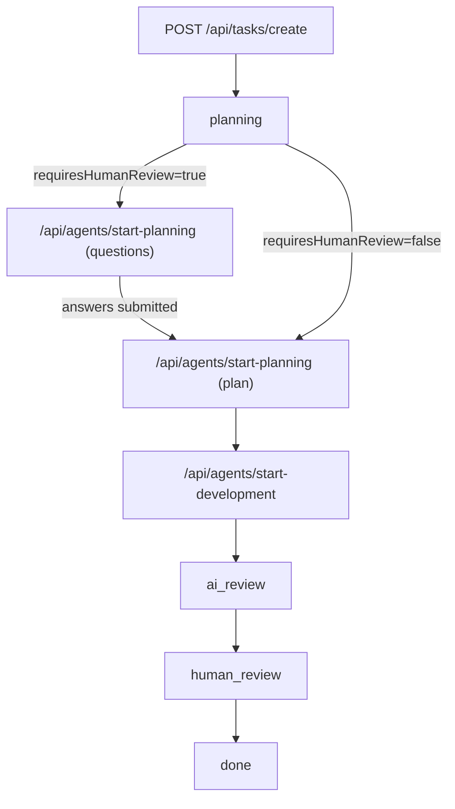

# Code-Auto — Master Implementation Plan

**Last updated:** 2026-01-25  
**This file is the single source of truth.** All other project markdown planning/status docs were consolidated here and will be removed.

## What we’re building
Code-Auto is a Next.js app that turns a “task” into an Code-Auto style workflow:

- **Kanban workflow**: `planning → in_progress → ai_review → human_review → done`
- **Isolated execution**: one **git worktree + branch per task**
- **Pluggable agent runtime**: a `CLIAdapter` interface with multiple providers
- **Real-time visibility**: stream agent logs to the UI (SSE)

## Current state (code-backed)

### Working
- **Kanban UI + workflow plumbing**: task cards, phase transitions, modals (`src/components/**`)
- **Task persistence**: file-based JSON in `.code-auto/tasks/` (`src/lib/tasks/persistence.ts`)
- **Worktrees**: created on task create (best-effort), branch naming `code-auto/{taskId}` (`src/lib/git/worktree.ts`, `src/app/api/tasks/create/route.ts`)
- **Git status UI + API**: `/api/git/status` (`src/app/api/git/status/route.ts`)
- **SSE agent log streaming**: `/api/agents/stream` + UI terminal (`src/app/api/agents/stream/route.ts`, `src/components/agents/terminal.tsx`)
- **Auto-plan route** (no human review): generates a plan + subtasks (`src/app/api/agents/auto-plan/route.ts`)
- **Subtask JSON validation + feedback** (for subtask generation prompts): `src/lib/validation/subtask-validator.ts` + logic inside `src/lib/cli/amp.ts`

### Implemented, but has correctness gaps (see “Known issues”)
- **Dev vs QA sequential execution separation** is not robust.
- **Subtask wait timeout** is likely too short for real agent runs.

### Not implemented yet (explicit TODOs in code)
- **Human review actions**: create MR/PR, stage local review, open VS Code/folder  
  - TODOs in `src/components/tasks/human-review-modal.tsx`
- **Memory context injection** into agent start route  
  - TODO in `src/app/api/agents/start/route.ts`
- **Settings UI**: there is no `src/app/settings/*` route currently.

## Architecture (as implemented)

### Data & persistence
- **Tasks**: `.code-auto/tasks/{taskId}.json`
- **Per-task logs**: `.code-auto/tasks/{taskId}/*-logs.txt` (planning/dev/review/auto-plan/direct execution)
- **Code-Auto compatibility view**: `.code-auto/implementation_plan.json` (updated on every task save)

### Git worktrees
- Worktree base: `.code-auto/worktrees/{taskId}/`
- Branch per task: `code-auto/{taskId}`
- Created in `POST /api/tasks/create` via `WorktreeManager.createWorktree()`

### Agent runtime
- **AgentManager** (`src/lib/agents/manager.ts`)
  - Concurrency limit: 12
  - `startAgent()` runs `execute()` async in the background and stores logs in memory (`AgentSession.logs`)
- **Agent manager registry** (`src/lib/agents/registry.ts`)
  - Selects provider per task (`task.cliTool`) and keeps per-task managers in memory
  - Tracks `threadId → manager` so `GET /api/agents/stream` and `POST /api/agents/stop` work with multiple providers
- **Log streaming**: `GET /api/agents/stream?threadId=...` streams `AgentSession.logs` over SSE

### CLI adapter layer
- Interface + shared types: `src/lib/cli/base.ts`
- Factory: `src/lib/cli/factory.ts`
- Providers today:
  - `MockCLIAdapter` (`src/lib/cli/mock.ts`) — testing/simulation, respects per-thread working directory
  - `AmpAdapter` (`src/lib/cli/amp.ts`) — uses `@sourcegraph/amp-sdk` (`execute()`), includes subtask validation feedback loop
  - **Amp preflight** (`src/lib/amp/preflight.ts`, `GET /api/amp/preflight`) — local-dev checks for `which amp` + login/API key readiness; UI blocks Amp runs until ready

### UI state
- Zustand task store: `src/store/task-store.ts`
- Primary views/modals:
  - board: `src/components/kanban/*`
  - task detail page: `src/app/task/[id]/page.tsx`
  - modals: `src/components/tasks/*`
  - agent terminal: `src/components/agents/terminal.tsx`

## Runtime workflow (routes + state transitions)



### Task creation
- **Route**: `POST /api/tasks/create`
- **Effects**:
  - Creates task JSON
  - Attempts worktree creation and saves `worktreePath`/`branchName` if successful

### Planning (human review optional)
- **Route**: `POST /api/agents/start-planning`
- **If** `requiresHumanReview=true`:
  - agent returns `{ questions: [...] }` JSON
  - task moves to `planningStatus=waiting_for_answers`
- **Else**:
  - agent returns `{ plan: "...markdown..." }` JSON
  - task is auto-approved and triggers `POST /api/agents/start-development`

### Auto-plan (no human review)
- **Route**: `POST /api/agents/auto-plan`
  - Phase 1: plan generation (markdown or JSON containing plan)
  - Phase 2: subtask generation (JSON)
  - Saves plan, marks approved, saves subtasks

### Development + sequential execution + QA auto-run
- **Route**: `POST /api/agents/start-development`
  - Generates subtasks
  - Saves them onto the task
  - Executes subtasks sequentially
  - When all dev subtasks complete, moves to `ai_review` and auto-starts QA verification
  - When all QA subtasks complete, moves to `human_review`

### Direct execution (testing / minimal flow)
- **Route**: `POST /api/agents/execute-direct`
  - Chooses provider from `task.cliTool` by instantiating a dedicated `AgentManager`
  - Initializes adapter with `cwd = task.worktreePath` (if present)
  - Executes a single command/prompt and moves the task to `human_review`

### Log streaming
- **Route**: `GET /api/agents/stream?threadId=...`
  - Streams in-memory logs from `AgentManager.activeAgents`
  - Works for single-process dev; not resilient across restarts/multi-instance deployments

## Known issues / risks (must-fix before relying on real Amp runs)

### 1) Dev/QA sequencing can run QA at the wrong time
- `start-development` generates dev+qa subtasks, saves combined list to `task.subtasks`, but sequential execution uses the raw list passed in.
- **Impact**: if QA subtasks are included in that list, they may run during dev and then again in AI review.

### 2) 60s “wait for subtask completion” is too short
- `waitForSubtaskCompletion()` and `waitForQASubtaskCompletion()` max wait is 60s.
- **Impact**: real tasks can exceed 60s; the loop may proceed while the agent is still running.

### 3) SSE is in-memory only
- Logs are stored in memory in the server process.
- **Impact**: server restarts lose logs; multi-instance deployments won’t share state.

## Canonical backlog (single TODO list)

### P0 — Fix correctness for real execution
- **Make provider selection per task** for `start-planning`, `start-development`, `auto-plan`:
  - Use `task.cliTool` and `task.cliConfig` instead of singleton defaults.
- **Make working directory per thread** for Amp adapter:
  - Use `threadId → workingDir` mapping when building SDK options.
- **Separate dev execution from QA execution**:
  - Execute only `type=dev` in dev phase; only `type=qa` in AI review.
- **Replace 60s waits** with a robust completion mechanism:
  - Wait on `AgentSession.status` and/or extend timeouts with sensible defaults.

### P1 — Finish the “human review” loop
- Implement MR/PR creation and local review actions currently TODO:
  - `src/components/tasks/human-review-modal.tsx`
- Add endpoints to support those actions (push branch, create PR, open folder/editor).
### P2 — Memory + settings + integrations
- Add memory persistence and context injection path (currently TODO in `src/app/api/agents/start/route.ts`).
- Add a settings page (no `src/app/settings/*` currently).
- Cost tracking dashboard + budget alerts.
- GitHub/GitLab issue import and PR sync.

## Operational runbook

### Local development
```bash
yarn install
yarn dev
```

### E2E tests
```bash
yarn test:e2e
```

### Real Amp smoke test (minimal cost)
1. Confirm local Amp readiness (the UI checks this too):
   - `which amp` returns a path
   - `amp login` completed (preferred) **or** `AMP_API_KEY` is set
   - `GET /api/amp/preflight` returns `canRunAmp: true`
2. Create a task with `cliTool: "amp"` (New Task modal should show “Amp readiness: Ready”).
3. Trigger a low-cost run:
   - `POST /api/agents/execute-direct` with a tiny prompt (e.g. “create TEST.md with hello”)
4. Verify file changes landed in the task’s worktree (`task.worktreePath`) and not in the main repo root.
## Definition of done (MVP)
- A task can reliably go from creation → planning → dev subtasks → QA subtasks → human review.
- All file changes happen inside the task’s worktree.
- UI shows real-time logs.
- Human review provides a path to produce a PR/MR (or at least stage changes locally).

