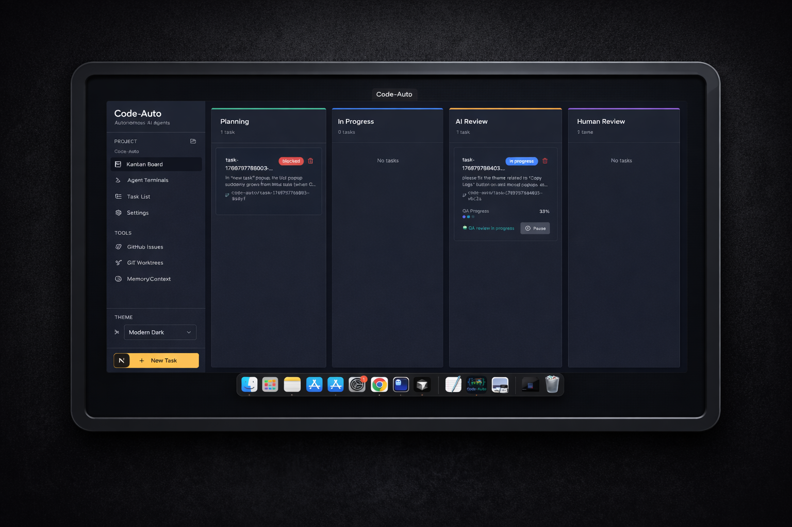
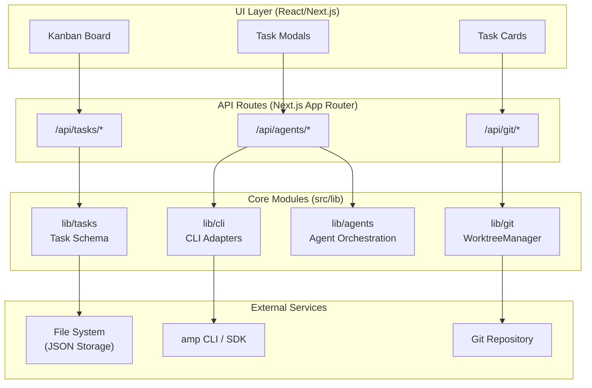

# Code-Auto 🔁

<a href="https://youtu.be/jNYMC-HXDNA" target="_blank" rel="noopener noreferrer">
  
</a>

_"Ever since the first MVP was shipped, Code-Auto has started modifying its **own code**..."_ — It felt weird at first, but it is fun to watch it ship its own features one by one to production. That's the power of a clean workflow design!

---

## Table of Contents

- [1. Introduction](#1-introduction)
  - [What is Code-Auto](#what-is-code-auto)
  - [Features](#features)
  - [Architecture](#architecture)
  - [Workflow](#workflow)
- [2. For Users](#2-for-users)
  - [Prerequisites](#prerequisites)
  - [Installation](#installation)
  - [Supported Platforms & Assets](#supported-platforms--assets)
  - [macOS: "Damaged" App Fix](#macos-damaged-app-fix)
  - [Windows: SmartScreen Warning](#windows-smartscreen-warning)
  - [Configuring AI Agents](#configuring-ai-agents)
- [3. For Developers](#3-for-developers)
  - [Prerequisites](#prerequisites-1)
  - [Clone & Setup](#clone--setup)
  - [Building for Distribution](#building-for-distribution)
  - [Releases](#releases)
  - [Development](#development)
  - [Available Scripts](#available-scripts)
  - [Git Hooks](#git-hooks)
  - [API Overview](#api-overview)
  - [CLI Adapters](#cli-adapters)
  - [Project Structure](#project-structure)
  - [Documentation](#documentation)
- [License](#license)

---

## 1. Introduction

### What is Code-Auto

Code-Auto is a **desktop app** (Electron) for orchestrating AI coding tasks through a structured 5-phase Kanban workflow. Each task runs in an isolated git worktree with its own branch, ensuring clean separation between concurrent tasks.

It runs on **macOS, Windows, and Linux**. On startup, you select a **project folder** to work with; tasks, worktrees, and agent logs are scoped to that project. The selected path is persisted for future sessions. Any absolute path works (e.g. `D:\repos\project` on Windows, `/mnt/projects` on Linux).

### Features

- **Desktop App**: Electron-based native app for macOS, Windows, and Linux with custom icons and theme-aware dock/tray icons
- **Open Project**: Select any project folder on startup; tasks, worktrees, and agent logs are scoped to the selected project
- **5-Phase Workflow**: Tasks progress through `planning → in_progress → ai_review → human_review → done`
- **Git Isolation**: Per-task worktrees in `.code-auto/worktrees/{taskId}/` with branch `code-auto/{taskId}`
- **Pluggable Execution**: CLIAdapter layer supporting multiple AI backends (Mock, Amp SDK, Cursor Agent CLI)
- **Live Streaming**: Agent output streamed to the UI via Server-Sent Events (SSE)
- **File-Based Storage**: Tasks persisted as JSON in `.code-auto/tasks/`
- **Review Locally**: In Human Review phase, open Cursor or VS Code at the task worktree; open folder in file manager

### Architecture

The system follows a layered architecture with React/Next.js UI, API routes, core library modules, and external integrations.



See [docs/ARCHITECTURE.md](docs/ARCHITECTURE.md) for detailed documentation.

### Workflow

```
┌──────────┐    ┌─────────────┐    ┌───────────┐    ┌──────────────┐    ┌──────┐
│ Planning │ -> │ In Progress │ -> │ AI Review │ -> │ Human Review │ -> │ Done │
└──────────┘    └─────────────┘    └───────────┘    └──────────────┘    └──────┘
```

See [docs/KANBAN_WORKFLOW.md](docs/KANBAN_WORKFLOW.md) for a step-by-step breakdown with screenshots.

---

## 2. For Users

### Prerequisites

- **Node.js** — Required for the packaged app (it spawns the Next.js server as a subprocess). Install via [nodejs.org](https://nodejs.org/), or on macOS: Homebrew, nvm, Volta, fnm; on Linux: distro package manager or nvm; on Windows: official installer or nvm-windows.
- **Git** — Your project must be a git repository. Any absolute path works (e.g. `D:\repos\project` on Windows).

### Installation

1. Go to [GitHub Releases](https://github.com/danted4/Code-Auto/releases)
2. Download the package for your platform (see [Supported Platforms & Assets](#supported-platforms--assets) below)
3. Install Node.js if not already installed
4. Run the app — on first launch, select a project folder (git repository) to work with

### Supported Platforms & Assets

| Asset                               | Platform              | Description                       |
| ----------------------------------- | --------------------- | --------------------------------- |
| `Code-Auto-*-darwin-x64.dmg`        | macOS (Intel)         | Disk image for installation       |
| `Code-Auto-*-darwin-arm64.dmg`      | macOS (Apple Silicon) | Disk image for installation       |
| `Code-Auto-*-darwin-*.zip`          | macOS                 | Zip archive                       |
| `Code-Auto-*-linux-x86_64.AppImage` | Linux (x64)           | AppImage (portable)               |
| `Code-Auto-*_amd64.deb`             | Linux (Debian/Ubuntu) | Debian package                    |
| `Code-Auto-*-linux-x86_64.flatpak`  | Linux (Flatpak)       | Flatpak (sandboxed)               |
| `Code-Auto-*-win32-x64.exe`         | Windows (x64)         | NSIS installer / portable         |
| `checksums.sha256`                  | All                   | SHA256 checksums for verification |

### macOS: "Damaged" App Fix

If macOS shows **"Code-Auto is damaged and can't be opened"** after downloading (common with unsigned apps from the internet), run in Terminal:

```bash
xattr -cr /Applications/Code-Auto.app
```

Then open the app again. This removes the quarantine flag that browsers add to downloaded files.

**To avoid this workaround:** The app can be code-signed and notarized with an Apple Developer account. See [docs/CODE_SIGNING.md](docs/CODE_SIGNING.md) for setup.

### Windows: SmartScreen Warning

If Windows shows **"Windows protected your PC"** or **"SmartScreen prevented an unrecognized app from starting"** when opening the downloaded `.exe` (common with unsigned apps from the internet), click **More info**, then **Run anyway** to launch the app.

**To avoid this workaround:** The app can be code-signed with a Windows code signing certificate. See [docs/CODE_SIGNING.md](docs/CODE_SIGNING.md) for options.

### Configuring AI Agents

Code-Auto supports multiple AI agent backends. Choose one to run tasks:

**Option 1: Amp SDK**

```bash
amp login         # Authenticate
```

Or set `AMP_API_KEY` in your environment.

**Option 2: Cursor Agent CLI**

```bash
agent login       # Authenticate
```

Or set `CURSOR_API_KEY` in your environment.

**Option 3: Mock Adapter (Testing)**

Without Amp or Cursor configured, the system uses the `MockCLIAdapter` for simulated responses (no API costs). **Note:** Mock is available in dev mode only; the packaged app exposes only Amp and Cursor.

---

## 3. For Developers

### Prerequisites

- **Node.js 18+** — [Download](https://nodejs.org/)
- **Git 2.20+** — Required for worktree functionality
- **yarn**, **npm**, or **pnpm** — Package manager

```bash
node --version  # Should be v18.0.0 or higher
git --version   # Should be 2.20.0 or higher
```

### Clone & Setup

```bash
git clone https://github.com/danted4/Code-Auto.git
cd Code-Auto
yarn install
```

### Building for Distribution

```bash
yarn build
```

The build script:

1. Builds platform icons (Windows .ico, Linux PNGs)
2. Runs `next build` with `output: 'standalone'`
3. Copies `public` and `.next/static` into `.next/standalone/`
4. Runs electron-builder for the current platform (macOS: DMG/ZIP; Linux: AppImage/deb/Flatpak; Windows: NSIS/portable). Uses `--publish never` so builds work without GH_TOKEN.
5. Uses an `afterPack` hook to copy `node_modules` and remove broken symlinks

**Platform-specific builds:** `yarn build:mac`, `yarn build:linux`, `yarn build:win` — or `yarn build:all` for all platforms (Windows from macOS/Linux requires Wine).

**Apple Silicon (M1/M2/M3):** `yarn build:all` fails on arm64. Use `yarn build:mac` for local macOS builds, or `yarn build:all:rosetta` under Rosetta 2. For releases, prefer GitHub Actions — each platform builds natively.

**Code signing:** See [docs/CODE_SIGNING.md](docs/CODE_SIGNING.md) for macOS and Windows signing setup.

### Releases

Releases are published via [GitHub Actions](.github/workflows/release.yml). To create a release:

```bash
git tag v2.2.0
git push origin v2.2.0
```

The workflow builds on platform-specific runners (Intel macOS, Apple Silicon macOS, Linux, Windows). Releases include SHA256 checksums and extract release notes from `CHANGELOG.md` when present.

**Manual trigger:** Actions → Release → Run workflow (dry run).

**Manual upload:** Avoid `gh release upload` for large binaries — it can corrupt DMG/ZIP. See [docs/RELEASE.md](docs/RELEASE.md) for alternatives.

### Development

```bash
yarn start        # Electron desktop app (recommended)
yarn next:dev     # Web-only mode at http://localhost:3000
```

On first run, you'll be prompted to **Open Project** — select a project folder to work with.

### Available Scripts

| Command                  | Description                                                                   |
| ------------------------ | ----------------------------------------------------------------------------- |
| `yarn start`             | Start Electron desktop app (Next.js dev + Electron)                           |
| `yarn build`             | Build packaged app for current platform                                       |
| `yarn build:mac`         | Build macOS only (DMG + ZIP)                                                  |
| `yarn build:mac:x64`     | Build macOS Intel only                                                        |
| `yarn build:mac:arm64`   | Build macOS Apple Silicon only                                                |
| `yarn build:linux`       | Build Linux only (AppImage + deb + Flatpak)                                   |
| `yarn build:win`         | Build Windows only (NSIS + portable exe)                                      |
| `yarn build:all`         | Build all platforms (cross-compile; requires Wine on macOS/Linux for Windows) |
| `yarn build:all:rosetta` | Build all platforms under Rosetta 2 (Apple Silicon workaround)                |
| `yarn next:dev`          | Next.js dev server only (web-only mode)                                       |
| `yarn next:build`        | Next.js production build only                                                 |
| `yarn lint`              | Run ESLint                                                                    |
| `yarn lint:fix`          | Run ESLint with auto-fix                                                      |
| `yarn format`            | Format code with Prettier                                                     |
| `yarn format:check`      | Check code formatting                                                         |
| `yarn typecheck`         | Run TypeScript type check                                                     |
| `yarn test`              | Run Vitest unit tests                                                         |
| `yarn test:e2e`          | Run Playwright end-to-end tests                                               |

### Git Hooks

Pre-commit hooks run automatically via [Husky](https://typicode.github.io/husky/): ESLint, Prettier on staged files. Skip with `git commit --no-verify`.

### API Overview

| Endpoint              | Method | Description                |
| --------------------- | ------ | -------------------------- |
| `/api/tasks`          | GET    | List all tasks             |
| `/api/tasks`          | POST   | Create a new task          |
| `/api/tasks/[id]`     | GET    | Get task details           |
| `/api/tasks/[id]`     | PATCH  | Update task                |
| `/api/tasks/[id]/run` | POST   | Execute task with AI agent |

See [docs/API_ROUTES.md](docs/API_ROUTES.md) for the complete API reference.

### CLI Adapters

| Adapter          | Description                     | Status                   |
| ---------------- | ------------------------------- | ------------------------ |
| `MockCLIAdapter` | Simulated responses for testing | ✅ Available in dev mode |
| `AmpAdapter`     | Sourcegraph Amp SDK integration | ✅ Available             |
| `CursorAdapter`  | Cursor Agent CLI integration    | ✅ Available             |

See [docs/CURSOR_INTEGRATION.md](docs/CURSOR_INTEGRATION.md) and [docs/CLI_ADAPTERS.md](docs/CLI_ADAPTERS.md).

### Project Structure

```
├── build/                # Build-time assets (entitlements, icons)
├── electron/             # Electron main process (main.js, preload.js)
├── scripts/             # Build and tooling scripts
├── src/
│   ├── app/              # Next.js App Router (api, pages)
│   ├── components/       # React components
│   └── lib/              # Core modules (agents, cli, git, tasks)
└── public/              # Static assets
```

### Documentation

- [docs/KANBAN_WORKFLOW.md](docs/KANBAN_WORKFLOW.md) — Step-by-step Kanban workflow with screenshots
- [docs/OVERVIEW.md](docs/OVERVIEW.md) — High-level introduction and features
- [docs/ARCHITECTURE.md](docs/ARCHITECTURE.md) — System architecture and design patterns
- [docs/API_ROUTES.md](docs/API_ROUTES.md) — Complete API reference
- [docs/CLI_ADAPTERS.md](docs/CLI_ADAPTERS.md) — CLI adapter architecture
- [docs/CURSOR_INTEGRATION.md](docs/CURSOR_INTEGRATION.md) — Cursor Agent CLI setup
- [docs/COMPONENTS.md](docs/COMPONENTS.md) — UI component hierarchy
- [docs/PACKAGED_APP.md](docs/PACKAGED_APP.md) — Packaged app considerations
- [docs/RELEASE.md](docs/RELEASE.md) — Release process and GitHub Actions
- [docs/CODE_SIGNING.md](docs/CODE_SIGNING.md) — macOS and Windows code signing

---

## License

See [LICENSE](LICENSE).
