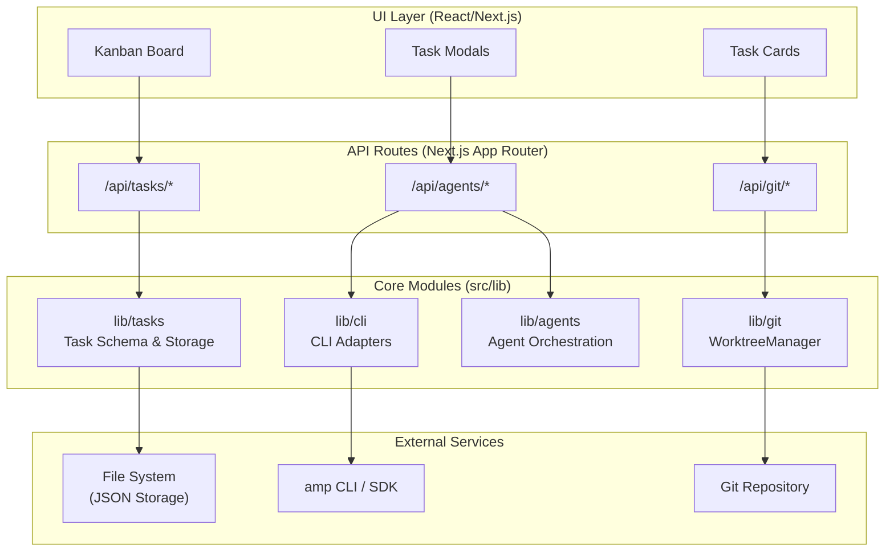

# Code-Auto

<p align="center">
  
</p>

A Next.js application for orchestrating AI coding tasks through a structured 5-phase Kanban workflow, with isolated git worktrees per task.

## Table of Contents

- [Overview](#overview)
- [Features](#features)
- [Architecture](#architecture)
- [Quick Start](#quick-start)
- [API Overview](#api-overview)
- [CLI Adapters](#cli-adapters)
- [Workflow](#workflow)
- [Project Structure](#project-structure)
- [Documentation](#documentation)
- [License](#license)

## Overview

Code-Auto automates AI-driven coding tasks by managing them through a Kanban-style workflow. Each task runs in an isolated git worktree with its own branch, ensuring clean separation between concurrent tasks.

## Features

- **5-Phase Workflow**: Tasks progress through `planning → in_progress → ai_review → human_review → done`
- **Git Isolation**: Per-task worktrees in `.code-auto/worktrees/{taskId}/` with branch `code-auto/{taskId}`
- **Pluggable Execution**: CLIAdapter layer supporting multiple AI backends (Mock, Amp SDK)
- **Live Streaming**: Agent output streamed to the UI via Server-Sent Events (SSE)
- **File-Based Storage**: Tasks persisted as JSON in `.code-auto/tasks/`

## Architecture

The system follows a layered architecture with React/Next.js UI, API routes, core library modules, and external integrations.



**Core Modules:**
- **lib/cli** — Pluggable CLI adapters for AI execution (Mock, Amp SDK)
- **lib/git** — WorktreeManager for per-task branch isolation
- **lib/agents** — Orchestrates agent sessions across workflow phases
- **lib/tasks** — Task schema, validation, and JSON file persistence

See [docs/ARCHITECTURE.md](docs/ARCHITECTURE.md) for detailed documentation.

## Quick Start

### Prerequisites

- **Node.js 18+** — [Download](https://nodejs.org/)
- **Git 2.20+** — Required for worktree functionality
- **yarn** **npm** or **pnpm** — Package manager

Verify your environment:

```bash
node --version  # Should be v18.0.0 or higher
git --version   # Should be 2.20.0 or higher
```

### Installation

1. **Clone the repository:**

   ```bash
   git clone https://github.com/danted4/Code-Auto.git
   cd Code-Auto
   ```

2. **Install dependencies:**

   ```bash
   yarn install
   ```

3. **Verify the setup:**

   ```bash
   yarn build
   ```

### Development

Start the development server:

```bash
yarn dev
```

Open [http://localhost:3000](http://localhost:3000) in your browser to access the Kanban board.

### Available Scripts

| Command | Description |
|---------|-------------|
| `yarn dev` | Start development server with hot reload |
| `yarn build` | Build for production |
| `yarn start` | Start production server |
| `yarn lint` | Run ESLint |
| `yarn test:e2e` | Run Playwright end-to-end tests |
| `yarn test:e2e:ui` | Run tests with Playwright UI |
| `yarn test:e2e:headed` | Run tests in headed browser mode |

### Using Amp (Optional)

This project includes an Amp SDK adapter (`@sourcegraph/amp-sdk`) for real AI-powered task execution.

**Option 1: Environment variable**

```bash
export AMP_API_KEY=your_key_here
yarn dev
```

**Option 2: CLI authentication**

```bash
amp login
yarn dev
```

Without Amp configured, the system uses the `MockCLIAdapter` for simulated responses.

## API Overview

| Endpoint | Method | Description |
|----------|--------|-------------|
| `/api/tasks` | GET | List all tasks |
| `/api/tasks` | POST | Create a new task |
| `/api/tasks/[id]` | GET | Get task details |
| `/api/tasks/[id]` | PATCH | Update task |
| `/api/tasks/[id]/run` | POST | Execute task with AI agent |

## CLI Adapters

Code-Auto uses a pluggable adapter system for AI execution:

| Adapter | Description | Status |
|---------|-------------|--------|
| `MockCLIAdapter` | Simulated responses for testing | ✅ Available |
| `AmpCLIAdapter` | Sourcegraph Amp SDK integration | ✅ Available |

## Workflow

```
┌──────────┐    ┌─────────────┐    ┌───────────┐    ┌──────────────┐    ┌──────┐
│ Planning │ -> │ In Progress │ -> │ AI Review │ -> │ Human Review │ -> │ Done │
└──────────┘    └─────────────┘    └───────────┘    └──────────────┘    └──────┘
```

1. **Planning**: Task is defined and queued
2. **In Progress**: AI agent executes the task in isolated worktree
3. **AI Review**: Automated checks run on changes
4. **Human Review**: Developer reviews and approves changes
5. **Done**: Task completed, changes ready for merge

## Project Structure

```
src/
├── app/
│   ├── api/              # API routes
│   └── page.tsx          # Main UI
├── components/           # React components
└── lib/
    ├── agents/           # Agent manager
    ├── cli/              # CLI adapters (Mock, Amp)
    ├── git/              # Worktree management
    └── tasks/            # Task persistence
```

## Documentation

- [IMPLEMENTATION_PLAN.md](IMPLEMENTATION_PLAN.md) — Master plan and backlog (single source of truth)
- [docs/OVERVIEW.md](docs/OVERVIEW.md) — High-level introduction, features, and how the system works
- [docs/ARCHITECTURE.md](docs/ARCHITECTURE.md) — System architecture, module structure, and design patterns
- [docs/API_ROUTES.md](docs/API_ROUTES.md) — Complete API reference for all endpoints
- [docs/CLI_ADAPTERS.md](docs/CLI_ADAPTERS.md) — Pluggable CLI adapter architecture and implementation guide
- [docs/COMPONENTS.md](docs/COMPONENTS.md) — UI component hierarchy and React component documentation
- [docs/DATA_FLOW.md](docs/DATA_FLOW.md) — Data flow patterns, Zustand stores, and state management
- [docs/TYPE_REFERENCE.md](docs/TYPE_REFERENCE.md) — TypeScript interfaces and type definitions
- [docs/WORKTREE.md](docs/WORKTREE.md) — Git worktree isolation strategy and WorktreeManager API

## License

See [LICENSE](LICENSE).
