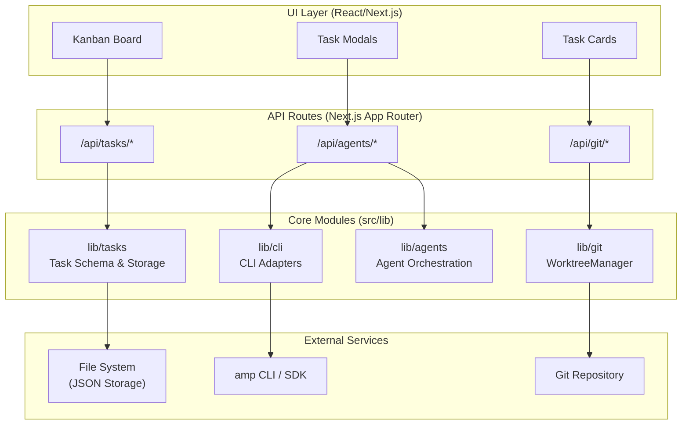

# Code-Auto 🔁

<a href="https://youtu.be/jNYMC-HXDNA" target="_blank" rel="noopener noreferrer">
  
</a>

#

<p style="font-size:18px"><i>"Ever since the first MVP was shipped, Code-Auto has started modifying its <b>own code</b>..."</i></p><p style="style=font-size:16px">It felt weird at first, but it is fun to watch it ship its own features one by one to production. That's the power of a clean workflow design !</p>

#

### What is Code-Auto ?

A Next.js ( Electron Desktop ) application for orchestrating AI coding tasks through a structured 5-phase Kanban workflow, with isolated git worktrees per task.

## Table of Contents

- [Overview](#overview)
- [Features](#features)
- [Architecture](#architecture)
- [Quick Start](#quick-start)
  - [Release Assets](#release-assets)
  - [macOS: "Damaged" App Fix](#macos-damaged-app-fix)
- [Releases](#releases)
- [API Overview](#api-overview)
- [CLI Adapters](#cli-adapters)
- [Workflow](#workflow)
- [Project Structure](#project-structure)
- [Documentation](#documentation)
- [License](#license)

## Overview

Code-Auto automates AI-driven coding tasks by managing them through a Kanban-style workflow. Each task runs in an isolated git worktree with its own branch, ensuring clean separation between concurrent tasks.

Code-Auto runs as a **desktop app** (Electron) on macOS, Windows, and Linux. On startup, you select a **project folder** to work with; tasks, worktrees, and agent logs are scoped to that project. The selected path is persisted for future sessions.

## Features

- **Desktop App**: Electron-based native app for macOS, Windows, and Linux with custom icons and theme-aware dock/tray icons
- **Open Project**: Select any project folder on startup; tasks, worktrees, and agent logs are scoped to the selected project
- **5-Phase Workflow**: Tasks progress through `planning → in_progress → ai_review → human_review → done`
- **Git Isolation**: Per-task worktrees in `.code-auto/worktrees/{taskId}/` with branch `code-auto/{taskId}`
- **Pluggable Execution**: CLIAdapter layer supporting multiple AI backends (Mock, Amp SDK, Cursor Agent CLI)
- **Live Streaming**: Agent output streamed to the UI via Server-Sent Events (SSE)
- **File-Based Storage**: Tasks persisted as JSON in `.code-auto/tasks/`
- **Review Locally**: In Human Review phase, open Cursor or VS Code at the task worktree; open folder in file manager

## Architecture

The system follows a layered architecture with React/Next.js UI, API routes, core library modules, and external integrations.



**Core Modules:**

- **lib/cli** — Pluggable CLI adapters for AI execution (Mock, Amp SDK, Cursor CLI)
- **lib/git** — WorktreeManager for per-task branch isolation
- **lib/agents** — Orchestrates agent sessions across workflow phases
- **lib/tasks** — Task schema, validation, and JSON file persistence

See [docs/ARCHITECTURE.md](docs/ARCHITECTURE.md) for detailed documentation.

## Quick Start

### Prerequisites

- **Node.js 18+** — [Download](https://nodejs.org/) (required for development and for the packaged app)
- **Git 2.20+** — Required for worktree functionality
- **yarn**, **npm**, or **pnpm** — Package manager

Verify your environment:

```bash
node --version  # Should be v18.0.0 or higher
git --version  # Should be 2.20.0 or higher
```

> **Note for packaged app users:** The DMG/ZIP app requires Node.js to be installed (Homebrew, nvm, Volta, or fnm). The app spawns the Next.js server as a subprocess.

### Installation

1. **Clone the repository:**

   ```bash
   git clone https://github.com/danted4/Code-Auto.git
   cd Code-Auto
   ```

2. **Install dependencies:**

   ```bash
   yarn install
   ```

3. **Verify the setup:**

   ```bash
   yarn build
   ```

   The build produces Next.js standalone output, copies `public` and `.next/static` into the standalone folder, then runs electron-builder. On macOS it creates DMG and ZIP; on Linux it creates AppImage and deb; on Windows it creates NSIS installer and portable exe.

### Building for Distribution

The `yarn build` script:

1. Builds platform icons (Windows .ico, Linux PNGs)
2. Runs `next build` with `output: 'standalone'` (minimal traced dependencies)
3. Copies `public` and `.next/static` into `.next/standalone/` (required for static assets)
4. Runs electron-builder for the current platform (macOS: DMG/ZIP; Linux: AppImage/deb; Windows: NSIS/portable)
5. Uses an `afterPack` hook to:
   - Copy `.next/standalone/node_modules` into the app (electron-builder excludes nested node_modules)
   - Remove broken symlinks (e.g. amp-sdk's `.bin/amp` → missing `@sourcegraph/amp`) that cause xattr/codesign to fail

The packaged app spawns the Next.js standalone server as a subprocess; Node.js must be installed on all platforms.

**Optional code signing:** Set `CSC_LINK`, `CSC_KEY_PASSWORD`, `APPLE_ID`, `APPLE_APP_SPECIFIC_PASSWORD`, and `APPLE_TEAM_ID` before building to sign and notarize the app. See [docs/CODE_SIGNING.md](docs/CODE_SIGNING.md).

**Platform-specific builds:** Use `yarn build:mac`, `yarn build:linux`, or `yarn build:win` to target a single platform. Use `yarn build:all` to build for all platforms from one machine (Windows builds from macOS/Linux require Wine).

**Apple Silicon (M1/M2/M3):** `yarn build:all` fails on arm64 because electron-builder's Linux (AppImage) and Windows tools (mksquashfs, Wine) are x86_64-only. Use `yarn build:mac` for local macOS builds, or `yarn build:all:rosetta` to run the full build under Rosetta 2 (requires Rosetta installed). For releases, prefer GitHub Actions — each platform builds natively.

### Release Assets

Pre-built packages are available in [GitHub Releases](https://github.com/danted4/Code-Auto/releases):

| Asset                               | Platform              | Description                       |
| ----------------------------------- | --------------------- | --------------------------------- |
| `Code-Auto-*-darwin-x64.dmg`        | macOS (Intel)         | Disk image for installation       |
| `Code-Auto-*-darwin-arm64.dmg`      | macOS (Apple Silicon) | Disk image for installation       |
| `Code-Auto-*-darwin-*.zip`          | macOS                 | Zip archive                       |
| `Code-Auto-*-linux-x86_64.AppImage` | Linux (x64)           | AppImage (portable)               |
| `Code-Auto-*_amd64.deb`             | Linux (Debian/Ubuntu) | Debian package                    |
| `Code-Auto-*-linux-x86_64.flatpak`  | Linux (Flatpak)       | Flatpak (sandboxed)               |
| `Code-Auto-*-win32-x64.exe`         | Windows (x64)         | NSIS installer / portable         |
| `checksums.sha256`                  | All                   | SHA256 checksums for verification |

**Installation:** Download the package for your platform. The app requires **Node.js** to be installed — it spawns the Next.js server as a subprocess. On macOS use Homebrew, nvm, Volta, or fnm; on Linux use your distro's package manager or nvm; on Windows use the official installer or nvm-windows.

### macOS: "Damaged" App Fix

If macOS shows **"Code-Auto is damaged and can't be opened"** after downloading (common with unsigned apps from the internet), run in Terminal:

```bash
xattr -cr /Applications/Code-Auto.app
```

Then open the app again. This removes the quarantine flag that browsers add to downloaded files.

**To avoid this workaround:** The app can be code-signed and notarized with an Apple Developer account. See [docs/CODE_SIGNING.md](docs/CODE_SIGNING.md) for setup.

## Releases

Releases are published via [GitHub Actions](.github/workflows/release.yml). To create a release:

```bash
git tag v2.2.0
git push origin v2.2.0
```

The workflow builds on platform-specific runners (no cross-compilation): Intel macOS (`macos-15-intel`), Apple Silicon macOS (`macos-15`), Linux (`ubuntu-latest`), and Windows (`windows-latest`). Each platform builds natively, avoiding Apple Silicon mksquashfs/Wine "bad CPU type" errors. Releases include SHA256 checksums and extract release notes from `CHANGELOG.md` when present. Add Apple Developer secrets (`CSC_LINK`, `CSC_KEY_PASSWORD`, `APPLE_ID`, `APPLE_APP_SPECIFIC_PASSWORD`, `APPLE_TEAM_ID`) to enable code signing and notarization for macOS — see [docs/CODE_SIGNING.md](docs/CODE_SIGNING.md).

**Manual trigger:** Go to Actions → Release → Run workflow to test the build pipeline without pushing a tag (dry run).

**Manual upload:** Avoid `gh release upload` for large binaries — it uses multipart encoding that can corrupt DMG/ZIP files. See [docs/RELEASE.md](docs/RELEASE.md) for alternatives.

### Development

Start the Electron desktop app (recommended):

```bash
yarn start
```

This launches the Code-Auto desktop app with the Kanban board. On first run, you'll be prompted to **Open Project** — select a project folder to work with. The selected path is persisted for future sessions.

For web-only development (no Electron):

```bash
yarn next:dev
```

Open [http://localhost:3000](http://localhost:3000) in your browser.

### Available Scripts

| Command                  | Description                                                                                                    |
| ------------------------ | -------------------------------------------------------------------------------------------------------------- |
| `yarn start`             | Start Electron desktop app (Next.js dev + Electron)                                                            |
| `yarn build`             | Build packaged Electron app for current platform (macOS: DMG/ZIP; Linux: AppImage/deb; Windows: NSIS/portable) |
| `yarn build:mac`         | Build macOS only (DMG + ZIP)                                                                                   |
| `yarn build:mac:x64`     | Build macOS Intel only                                                                                         |
| `yarn build:mac:arm64`   | Build macOS Apple Silicon only                                                                                 |
| `yarn build:linux`       | Build Linux only (AppImage + deb + Flatpak)                                                                    |
| `yarn build:win`         | Build Windows only (NSIS + portable exe)                                                                       |
| `yarn build:all`         | Build all platforms (macOS, Linux, Windows) — cross-compile from macOS                                         |
| `yarn build:all:rosetta` | Build all platforms under Rosetta 2 (Apple Silicon workaround for mksquashfs/Wine)                             |
| `yarn next:dev`          | Next.js dev server only (web-only mode)                                                                        |
| `yarn next:build`        | Next.js production build only                                                                                  |
| `yarn lint`              | Run ESLint                                                                                                     |
| `yarn lint:fix`          | Run ESLint with auto-fix                                                                                       |
| `yarn format`            | Format code with Prettier                                                                                      |
| `yarn format:check`      | Check code formatting                                                                                          |
| `yarn typecheck`         | Run TypeScript type check                                                                                      |
| `yarn test`              | Run Vitest unit tests                                                                                          |
| `yarn test:e2e`          | Run Playwright end-to-end tests                                                                                |
| `yarn test:e2e:ui`       | Run tests with Playwright UI                                                                                   |
| `yarn test:e2e:headed`   | Run tests in headed browser mode                                                                               |

### Git Hooks (Husky)

Pre-commit hooks run automatically via [Husky](https://typicode.github.io/husky/). On each commit:

- **ESLint** (with auto-fix) and **Prettier** run on staged `.js`, `.jsx`, `.ts`, `.tsx` files
- **Prettier** runs on staged `.json`, `.css`, `.md`, `.mjs` files

To skip hooks (e.g. for WIP commits): `git commit --no-verify`

### Configuring AI Agents (Optional)

Code-Auto supports multiple AI agent backends. Choose one or use Mock for testing:

#### Option 1: Amp SDK

```bash
amp login         # Authenticate
yarn start        # Start desktop app
```

Or use an environment variable:

```bash
export AMP_API_KEY=your_key_here
yarn start
```

#### Option 2: Cursor Agent CLI

```bash
agent login       # Authenticate
yarn start        # Start desktop app
```

Or use an environment variable:

```bash
export CURSOR_API_KEY=your_key_here
yarn start
```

#### Option 3: Mock Adapter (Testing)

Without Amp or Cursor configured, the system uses the `MockCLIAdapter` for simulated responses (no API costs). **Note:** Mock is hidden in the packaged app (DMG/ZIP); only Amp and Cursor are available.

## API Overview

| Endpoint              | Method | Description                |
| --------------------- | ------ | -------------------------- |
| `/api/tasks`          | GET    | List all tasks             |
| `/api/tasks`          | POST   | Create a new task          |
| `/api/tasks/[id]`     | GET    | Get task details           |
| `/api/tasks/[id]`     | PATCH  | Update task                |
| `/api/tasks/[id]/run` | POST   | Execute task with AI agent |

## CLI Adapters

Code-Auto uses a pluggable adapter system for AI execution:

| Adapter          | Description                     | Status       |
| ---------------- | ------------------------------- | ------------ |
| `MockCLIAdapter` | Simulated responses for testing | ✅ Available |
| `AmpAdapter`     | Sourcegraph Amp SDK integration | ✅ Available |
| `CursorAdapter`  | Cursor Agent CLI integration    | ✅ Available |

See [docs/CURSOR_INTEGRATION.md](docs/CURSOR_INTEGRATION.md) for detailed Cursor setup and usage.

## Workflow

```
┌──────────┐    ┌─────────────┐    ┌───────────┐    ┌──────────────┐    ┌──────┐
│ Planning │ -> │ In Progress │ -> │ AI Review │ -> │ Human Review │ -> │ Done │
└──────────┘    └─────────────┘    └───────────┘    └──────────────┘    └──────┘
```

See [docs/KANBAN_WORKFLOW.md](docs/KANBAN_WORKFLOW.md) for a step-by-step breakdown with screenshots.

1. **Planning**: Task is defined and queued
2. **In Progress**: AI agent executes the task in isolated worktree
3. **AI Review**: Automated checks run on changes
4. **Human Review**: Developer reviews and approves changes
5. **Done**: Task completed, changes ready for merge

## Project Structure

```
├── build/                # Build-time assets
│   ├── entitlements.mac.plist   # macOS code signing entitlements
│   ├── icon.ico         # Windows icon (generated)
│   └── icons/           # Linux icons (generated)
├── electron/             # Electron main process
│   ├── main.js           # App window, Next.js server spawn, IPC
│   └── preload.js        # Preload script for native APIs
├── scripts/               # Build and tooling scripts
│   ├── after-pack.js     # Copies node_modules, removes broken symlinks (all platforms)
│   ├── build-dock-icon.js
│   ├── build-icons.js    # Generates Windows .ico and Linux icons
│   ├── clean-dist.js     # Robust dist-electron cleanup
│   ├── dev.js            # Dev server launcher
│   └── prepare-build.js  # Cross-platform build prep (next build, copy)
├── src/
│   ├── app/              # Next.js App Router
│   │   ├── api/          # API routes
│   │   └── page.tsx      # Main UI
│   ├── components/       # React components
│   └── lib/
│       ├── agents/       # Agent manager
│       ├── cli/          # CLI adapters (Mock, Amp, Cursor)
│       ├── git/          # Worktree management
│       └── tasks/        # Task persistence
└── public/               # Static assets
```

## Documentation

- [docs/KANBAN_WORKFLOW.md](docs/KANBAN_WORKFLOW.md) — Step-by-step Kanban workflow with screenshots
- [docs/IMPLEMENTATION_PLAN.md](docs/IMPLEMENTATION_PLAN.md) — Master plan and backlog (single source of truth)
- [docs/OVERVIEW.md](docs/OVERVIEW.md) — High-level introduction, features, and how the system works
- [docs/ARCHITECTURE.md](docs/ARCHITECTURE.md) — System architecture, module structure, and design patterns
- [docs/API_ROUTES.md](docs/API_ROUTES.md) — Complete API reference for all endpoints
- [docs/CLI_ADAPTERS.md](docs/CLI_ADAPTERS.md) — Pluggable CLI adapter architecture and implementation guide
- [docs/CURSOR_INTEGRATION.md](docs/CURSOR_INTEGRATION.md) — Cursor Agent CLI integration guide
- [docs/COMPONENTS.md](docs/COMPONENTS.md) — UI component hierarchy and React component documentation
- [docs/DATA_FLOW.md](docs/DATA_FLOW.md) — Data flow patterns, Zustand stores, and state management
- [docs/TYPE_REFERENCE.md](docs/TYPE_REFERENCE.md) — TypeScript interfaces and type definitions
- [docs/WORKTREE.md](docs/WORKTREE.md) — Git worktree isolation strategy and WorktreeManager API
- [docs/PACKAGED_APP.md](docs/PACKAGED_APP.md) — Packaged app (DMG) considerations, env handling, and checklist
- [docs/RELEASE.md](docs/RELEASE.md) — Release process, GitHub Actions, manual upload (avoiding gh corruption)
- [docs/CODE_SIGNING.md](docs/CODE_SIGNING.md) — macOS code signing and notarization (eliminates xattr workaround)

## License

See [LICENSE](LICENSE).
