# Code-Auto 🔁

<p align="center">
  
</p>

A Next.js ( Electron Desktop ) application for orchestrating AI coding tasks through a structured 5-phase Kanban workflow, with isolated git worktrees per task.

## Table of Contents

- [Overview](#overview)
- [Features](#features)
- [Architecture](#architecture)
- [Quick Start](#quick-start)
- [API Overview](#api-overview)
- [CLI Adapters](#cli-adapters)
- [Workflow](#workflow)
- [Project Structure](#project-structure)
- [Documentation](#documentation)
- [License](#license)

## Overview

Code-Auto automates AI-driven coding tasks by managing them through a Kanban-style workflow. Each task runs in an isolated git worktree with its own branch, ensuring clean separation between concurrent tasks.

Code-Auto runs as a **desktop app** (Electron) on macOS, Windows, and Linux. On startup, you select a **project folder** to work with; tasks, worktrees, and agent logs are scoped to that project. The selected path is persisted for future sessions.

## Features

- **Desktop App**: Electron-based native app for macOS, Windows, and Linux with custom icons and theme-aware dock/tray icons
- **Open Project**: Select any project folder on startup; tasks, worktrees, and agent logs are scoped to the selected project
- **5-Phase Workflow**: Tasks progress through `planning → in_progress → ai_review → human_review → done`
- **Git Isolation**: Per-task worktrees in `.code-auto/worktrees/{taskId}/` with branch `code-auto/{taskId}`
- **Pluggable Execution**: CLIAdapter layer supporting multiple AI backends (Mock, Amp SDK, Cursor Agent CLI)
- **Live Streaming**: Agent output streamed to the UI via Server-Sent Events (SSE)
- **File-Based Storage**: Tasks persisted as JSON in `.code-auto/tasks/`

## Architecture

The system follows a layered architecture with React/Next.js UI, API routes, core library modules, and external integrations.

```mermaid
flowchart TB
    subgraph UI["UI Layer (React/Next.js)"]
        KB[Kanban Board]
        TM[Task Modals]
        TC[Task Cards]
    end

    subgraph API["API Routes (Next.js App Router)"]
        TA["/api/tasks/*"]
        AG["/api/agents/*"]
        GT["/api/git/*"]
    end

    subgraph LIB["Core Modules (src/lib)"]
        CLI["lib/cli<br/>CLI Adapters"]
        GIT["lib/git<br/>WorktreeManager"]
        AGENTS["lib/agents<br/>Agent Orchestration"]
        TASKS["lib/tasks<br/>Task Schema & Storage"]
    end

    subgraph EXTERNAL["External Services"]
        AMP["amp CLI / SDK"]
        FS["File System<br/>(JSON Storage)"]
        REPO["Git Repository"]
    end

    KB --> TA
    TM --> AG
    TC --> GT

    TA --> TASKS
    AG --> CLI
    AG --> AGENTS
    GT --> GIT

    CLI --> AMP
    TASKS --> FS
    GIT --> REPO
```



**Core Modules:**

- **lib/cli** — Pluggable CLI adapters for AI execution (Mock, Amp SDK, Cursor CLI)
- **lib/git** — WorktreeManager for per-task branch isolation
- **lib/agents** — Orchestrates agent sessions across workflow phases
- **lib/tasks** — Task schema, validation, and JSON file persistence

See [docs/ARCHITECTURE.md](docs/ARCHITECTURE.md) for detailed documentation.

## Quick Start

### Prerequisites

- **Node.js 18+** — [Download](https://nodejs.org/)
- **Git 2.20+** — Required for worktree functionality
- **yarn** **npm** or **pnpm** — Package manager

Verify your environment:

```bash
node --version  # Should be v18.0.0 or higher
git --version   # Should be 2.20.0 or higher
```

### Installation

1. **Clone the repository:**

   ```bash
   git clone https://github.com/danted4/Code-Auto.git
   cd Code-Auto
   ```

2. **Install dependencies:**

   ```bash
   yarn install
   ```

3. **Verify the setup:**

   ```bash
   yarn build
   ```

### Development

Start the Electron desktop app (recommended):

```bash
yarn start
```

This launches the Code-Auto desktop app with the Kanban board. On first run, you'll be prompted to **Open Project** — select a project folder to work with. The selected path is persisted for future sessions.

For web-only development (no Electron):

```bash
yarn next:dev
```

Open [http://localhost:3000](http://localhost:3000) in your browser.

### Available Scripts

| Command                | Description                                            |
| ---------------------- | ------------------------------------------------------ |
| `yarn start`           | Start Electron desktop app (Next.js dev + Electron)    |
| `yarn build`           | Build packaged Electron app for distribution           |
| `yarn next:dev`        | Next.js dev server only (web-only mode)                |
| `yarn next:build`      | Next.js production build only                          |
| `yarn lint`            | Run ESLint                                             |
| `yarn lint:fix`        | Run ESLint with auto-fix                               |
| `yarn format`          | Format code with Prettier                              |
| `yarn format:check`    | Check code formatting                                  |
| `yarn lint-staged`     | Run lint + format on staged files (used by pre-commit) |
| `yarn test:e2e`        | Run Playwright end-to-end tests                        |
| `yarn test:e2e:ui`     | Run tests with Playwright UI                           |
| `yarn test:e2e:headed` | Run tests in headed browser mode                       |

### Git Hooks (Husky)

Pre-commit hooks run automatically via [Husky](https://typicode.github.io/husky/). On each commit:

- **ESLint** (with auto-fix) and **Prettier** run on staged `.js`, `.jsx`, `.ts`, `.tsx` files
- **Prettier** runs on staged `.json`, `.css`, `.md`, `.mjs` files

To skip hooks (e.g. for WIP commits): `git commit --no-verify`

### Configuring AI Agents (Optional)

Code-Auto supports multiple AI agent backends. Choose one or use Mock for testing:

#### Option 1: Amp SDK

```bash
amp login         # Authenticate
yarn start        # Start desktop app
```

Or use an environment variable:

```bash
export AMP_API_KEY=your_key_here
yarn start
```

#### Option 2: Cursor Agent CLI

```bash
agent login       # Authenticate
yarn start        # Start desktop app
```

Or use an environment variable:

```bash
export CURSOR_API_KEY=your_key_here
yarn start
```

#### Option 3: Mock Adapter (Testing)

Without Amp or Cursor configured, the system uses the `MockCLIAdapter` for simulated responses (no API costs).

## API Overview

| Endpoint              | Method | Description                |
| --------------------- | ------ | -------------------------- |
| `/api/tasks`          | GET    | List all tasks             |
| `/api/tasks`          | POST   | Create a new task          |
| `/api/tasks/[id]`     | GET    | Get task details           |
| `/api/tasks/[id]`     | PATCH  | Update task                |
| `/api/tasks/[id]/run` | POST   | Execute task with AI agent |

## CLI Adapters

Code-Auto uses a pluggable adapter system for AI execution:

| Adapter          | Description                     | Status       |
| ---------------- | ------------------------------- | ------------ |
| `MockCLIAdapter` | Simulated responses for testing | ✅ Available |
| `AmpAdapter`     | Sourcegraph Amp SDK integration | ✅ Available |
| `CursorAdapter`  | Cursor Agent CLI integration    | ✅ Available |

See [docs/CURSOR_INTEGRATION.md](docs/CURSOR_INTEGRATION.md) for detailed Cursor setup and usage.

## Workflow

```
┌──────────┐    ┌─────────────┐    ┌───────────┐    ┌──────────────┐    ┌──────┐
│ Planning │ -> │ In Progress │ -> │ AI Review │ -> │ Human Review │ -> │ Done │
└──────────┘    └─────────────┘    └───────────┘    └──────────────┘    └──────┘
```

1. **Planning**: Task is defined and queued
2. **In Progress**: AI agent executes the task in isolated worktree
3. **AI Review**: Automated checks run on changes
4. **Human Review**: Developer reviews and approves changes
5. **Done**: Task completed, changes ready for merge

## Project Structure

```
src/
├── app/
│   ├── api/              # API routes
│   └── page.tsx          # Main UI
├── components/           # React components
└── lib/
    ├── agents/           # Agent manager
    ├── cli/              # CLI adapters (Mock, Amp)
    ├── git/              # Worktree management
    └── tasks/            # Task persistence
```

## Documentation

- [IMPLEMENTATION_PLAN.md](IMPLEMENTATION_PLAN.md) — Master plan and backlog (single source of truth)
- [docs/OVERVIEW.md](docs/OVERVIEW.md) — High-level introduction, features, and how the system works
- [docs/ARCHITECTURE.md](docs/ARCHITECTURE.md) — System architecture, module structure, and design patterns
- [docs/API_ROUTES.md](docs/API_ROUTES.md) — Complete API reference for all endpoints
- [docs/CLI_ADAPTERS.md](docs/CLI_ADAPTERS.md) — Pluggable CLI adapter architecture and implementation guide
- [docs/CURSOR_INTEGRATION.md](docs/CURSOR_INTEGRATION.md) — Cursor Agent CLI integration guide
- [docs/COMPONENTS.md](docs/COMPONENTS.md) — UI component hierarchy and React component documentation
- [docs/DATA_FLOW.md](docs/DATA_FLOW.md) — Data flow patterns, Zustand stores, and state management
- [docs/TYPE_REFERENCE.md](docs/TYPE_REFERENCE.md) — TypeScript interfaces and type definitions
- [docs/WORKTREE.md](docs/WORKTREE.md) — Git worktree isolation strategy and WorktreeManager API

## License

See [LICENSE](LICENSE).
