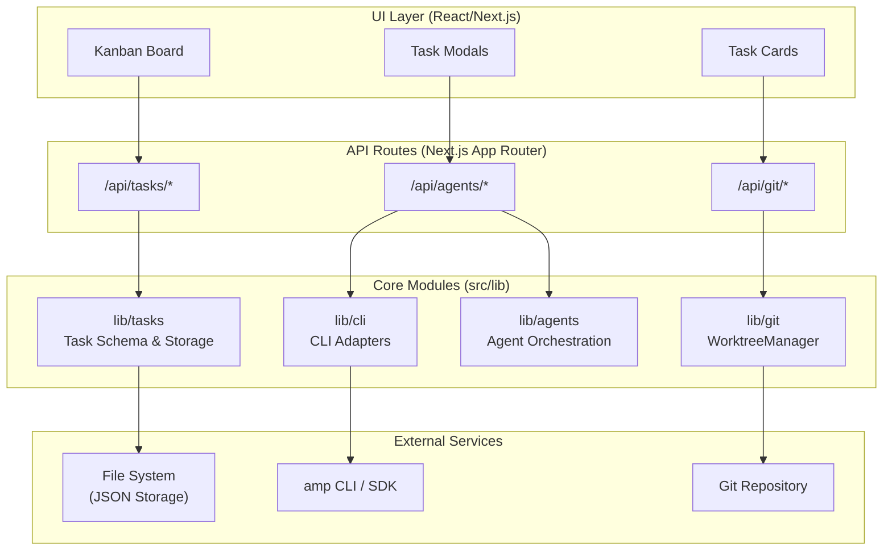
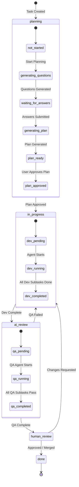
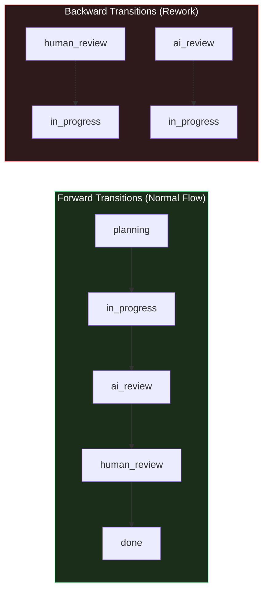
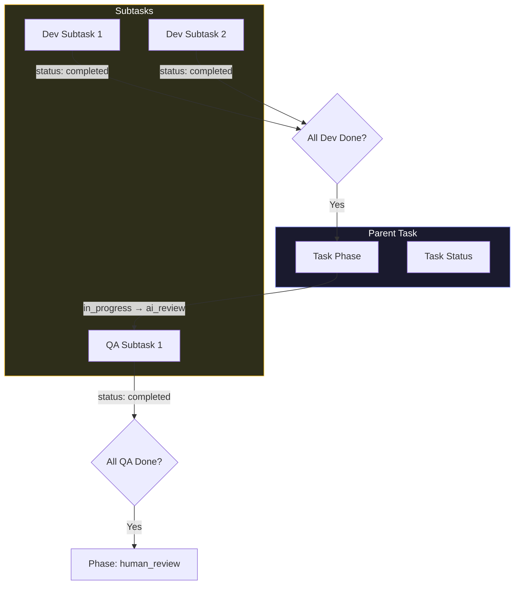

# Code-Auto Architecture

A Next.js + Electron desktop application that orchestrates AI coding tasks through a Kanban-style interface. The packaged app uses Next.js standalone output and spawns the server as a subprocess. See [PACKAGED_APP.md](./PACKAGED_APP.md) for packaging details.

## Project Purpose

Code-Auto enables developers to run multiple AI agents in parallel, each working in isolated git worktrees. It provides:

- **Kanban Board UI** - Visual task management across workflow phases
- **Parallel Agent Execution** - Multiple concurrent AI agents via amp CLI
- **Git Worktree Isolation** - Each task runs in its own branch/worktree
- **5-Phase Workflow** - Structured process from planning to completion

## System Architecture



## Core Modules

### `lib/cli` - CLI Adapters

> Types: [`CLIAdapter`](../src/lib/cli/base.ts#L8-L52), [`CLIConfig`](../src/lib/cli/base.ts#L54-L61), [`StreamMessage`](../src/lib/cli/base.ts#L70-L75)

Abstraction layer for AI agent execution. Supports multiple backends:

- **MockAdapter** - Simulated responses for testing ([src/lib/cli/mock.ts](../src/lib/cli/mock.ts)) — hidden in packaged app
- **AmpAdapter** - Sourcegraph Amp SDK integration ([src/lib/cli/amp.ts](../src/lib/cli/amp.ts))
- **CursorAdapter** - Cursor Agent CLI integration ([src/lib/cli/cursor.ts](../src/lib/cli/cursor.ts))

See [CLI_ADAPTERS.md](./CLI_ADAPTERS.md) for detailed documentation.

### `lib/git` - WorktreeManager

> Types: [`WorktreeInfo`](../src/lib/git/worktree.ts#L18-L24), [`WorktreeStatus`](../src/lib/git/worktree.ts#L26-L33)

Manages git worktrees for task isolation:

- Create/delete worktrees at `.code-auto/worktrees/{task-id}`
- Branch naming: `code-auto/{task-id}`
- Auto-detect main branch and repo root

See [WORKTREE.md](./WORKTREE.md) for detailed documentation.

### `lib/agents` - Agent Orchestration

> Types: [`AgentSession`](../src/lib/agents/manager.ts#L12-L20), [`AgentOptions`](../src/lib/agents/manager.ts#L28-L32), [`AgentResult`](../src/lib/agents/manager.ts#L34-L38)

Coordinates agent execution across task phases:

- Planning agents (Q&A, plan generation)
- Development agents (implementation)
- QA agents (review, verification)
- Up to 12 concurrent agents supported

### `lib/tasks` - Task Schema & Storage

> Types: [`Task`](../src/lib/tasks/schema.ts#L46-L82), [`Subtask`](../src/lib/tasks/schema.ts#L84-L92), [`WorkflowPhase`](../src/lib/tasks/schema.ts#L15)

File-based task persistence:

- JSON storage at `.code-auto/tasks/`
- Task schema with phase, subtasks, worktree info
- Zustand store for client state

See [TYPE_REFERENCE.md](./TYPE_REFERENCE.md) for complete type definitions.

## 5-Phase Task Workflow

### Task Lifecycle State Machine



### Phase Descriptions

| Phase            | Description                                                            | Entry Trigger  | Exit Trigger                 |
| ---------------- | ---------------------------------------------------------------------- | -------------- | ---------------------------- |
| **planning**     | AI generates questions, user answers, AI creates implementation plan   | Task created   | Plan approved by user        |
| **in_progress**  | Development subtasks executed by AI agents in worktree                 | Plan approved  | All `dev` subtasks completed |
| **ai_review**    | QA agents verify implementation against requirements                   | Dev complete   | All `qa` subtasks pass       |
| **human_review** | Developer reviews changes; Review Locally (open Cursor/VS Code/folder) | QA complete    | User approves or merges PR   |
| **done**         | Task complete, branch ready for merge                                  | Human approval | N/A (terminal state)         |

### Valid State Transitions



| Transition                     | Trigger                                     | Automation                                                          |
| ------------------------------ | ------------------------------------------- | ------------------------------------------------------------------- |
| `planning` → `in_progress`     | User approves plan; subtasks generated      | Task stays in planning until subtasks ready; then dev agent spawned |
| `in_progress` → `ai_review`    | All `dev` subtasks reach `completed` status | QA agent auto-spawned                                               |
| `ai_review` → `human_review`   | All `qa` subtasks reach `completed` status  | Notification sent to user                                           |
| `ai_review` → `in_progress`    | QA subtask fails or reports issues          | Dev agent re-spawned for fixes                                      |
| `human_review` → `done`        | User approves or merges PR                  | Branch cleanup optional                                             |
| `human_review` → `in_progress` | User requests changes                       | Dev agent re-spawned                                                |

### Planning Phase Sub-States

The planning phase has its own internal state machine tracked by `planningStatus`:

| Status                 | Description                                                |
| ---------------------- | ---------------------------------------------------------- |
| `not_started`          | Task created, planning not initiated                       |
| `generating_questions` | AI analyzing requirements, generating clarifying questions |
| `waiting_for_answers`  | Questions displayed, awaiting user input                   |
| `generating_plan`      | AI generating implementation plan from answers             |
| `plan_ready`           | Plan generated, awaiting user approval                     |
| `plan_approved`        | User approved plan, ready to transition to `in_progress`   |

### Subtask Relationship to Parent Task Status



**Subtask Types:**

- **`dev`** - Development subtasks (implementation work)
- **`qa`** - Quality assurance subtasks (verification/testing)

**Status Aggregation Rules:**

| Parent Phase  | Subtask Type | Completion Rule                                                |
| ------------- | ------------ | -------------------------------------------------------------- |
| `in_progress` | `dev`        | Task advances when ALL `dev` subtasks have `status: completed` |
| `ai_review`   | `qa`         | Task advances when ALL `qa` subtasks have `status: completed`  |

**Subtask Status Values:**

- `pending` - Not started
- `in_progress` - Agent actively working
- `completed` - Successfully finished
- `blocked` - Waiting on dependency or external factor

**Locking Behavior:**

- Tasks with `locked: true` cannot be dragged between phases
- Tasks in `planning` phase with `requiresHumanReview: true` are locked until `planApproved: true`
- Tasks with an active `assignedAgent` should not be manually moved

## Key Technologies

- **Next.js 15** - App Router, TypeScript
- **Tailwind CSS + shadcn/ui** - Component styling
- **Zustand** - Client state management
- **dnd-kit** - Drag-and-drop for Kanban
- **amp SDK** - AI agent execution

## Directory Structure

```
src/
├── app/                 # Next.js App Router
│   └── api/             # API routes
│       ├── tasks/       # Task CRUD
│       ├── agents/      # Agent execution
│       └── git/         # Worktree operations
├── components/          # React components
│   └── tasks/           # Task-related UI
├── lib/                 # Core business logic
│   ├── cli/             # CLI adapters
│   ├── git/             # WorktreeManager
│   ├── agents/          # Agent orchestration
│   └── tasks/           # Task schema/storage
└── store/               # Zustand stores
```
