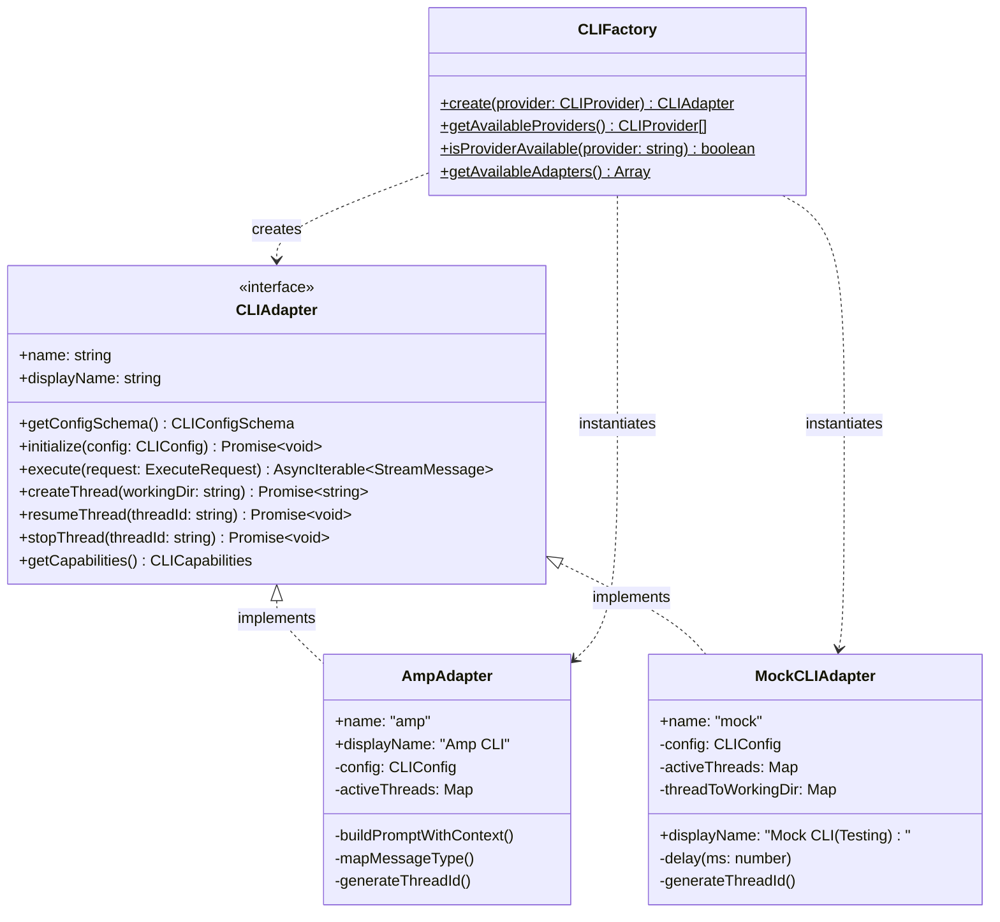

# CLI Adapters

This document describes the pluggable CLI adapter architecture used in Code-Auto, enabling support for multiple AI coding assistants.

## Overview

Code-Auto uses a **pluggable adapter pattern** to abstract CLI tool interactions. This allows the system to:
- Swap between different AI coding CLIs (amp, aider, cursor, etc.)
- Use a mock adapter for testing without API costs
- Dynamically configure adapters via the UI

## Architecture



## Components

### Base Interface ([src/lib/cli/base.ts](../src/lib/cli/base.ts))

Defines the contract all CLI adapters must implement:

| Method | Description |
|--------|-------------|
| `getConfigSchema()` | Returns UI configuration fields for this adapter |
| `initialize(config)` | Sets up the adapter with API keys, working directory, etc. |
| `execute(request)` | Executes a task, returning an async stream of messages |
| `createThread(workingDir)` | Creates an isolated execution thread |
| `resumeThread(threadId)` | Resumes an existing thread |
| `stopThread(threadId)` | Stops a running thread |
| `getCapabilities()` | Returns adapter capabilities (threads, modes, limits) |

**Key Types** (see [TYPE_REFERENCE.md](./TYPE_REFERENCE.md#cli-adapter-types) for full definitions):

| Type | Lines | Description |
|------|-------|-------------|
| [`CLIAdapter`](../src/lib/cli/base.ts#L8-L52) | 8-52 | Core interface for all adapters |
| [`CLIConfig`](../src/lib/cli/base.ts#L54-L61) | 54-61 | API key, working directory, mode, permissions |
| [`ExecuteRequest`](../src/lib/cli/base.ts#L63-L68) | 63-68 | Prompt, optional thread ID, injected context |
| [`StreamMessage`](../src/lib/cli/base.ts#L70-L75) | 70-75 | Typed messages (system, assistant, tool, result, error) |
| [`CLICapabilities`](../src/lib/cli/base.ts#L77-L82) | 77-82 | Feature flags and limits |
| [`ContextData`](../src/lib/cli/base.ts#L89-L93) | 89-93 | Memory context (patterns, gotchas, history) |

### Amp Adapter ([src/lib/cli/amp.ts](../src/lib/cli/amp.ts))

Production adapter integrating with `@sourcegraph/amp-sdk`:

```typescript
import { execute as ampExecute } from '@sourcegraph/amp-sdk';
```

**Features:**
- Executes real AI agent tasks via Amp CLI
- Supports smart (Opus 4.5) and rush (Haiku 4.5) modes
- Injects context from the memory system into prompts
- Thread management with abort support
- Maps amp message types to standard `StreamMessage` format

**⚠️ Warning:** Uses paid API credits. Use Mock adapter for development/testing.

### Mock Adapter ([src/lib/cli/mock.ts](../src/lib/cli/mock.ts))

Testing adapter that simulates CLI responses without API calls:

**Features:**
- Simulates realistic message streams with configurable delays
- Handles planning prompts (questions, plans)
- Handles subtask generation and execution
- Writes to `subtask-attendance.txt` for verification testing
- Supports all interface methods

**Use Cases:**
- UI development without burning credits
- E2E testing of the task orchestration pipeline
- Debugging workflow logic

### Factory ([src/lib/cli/factory.ts](../src/lib/cli/factory.ts))

Creates adapter instances using the factory pattern:

```typescript
import { CLIFactory } from '@/lib/cli/factory';

// Create an adapter
const adapter = CLIFactory.create('amp'); // or 'mock'

// Get available options for UI
const providers = CLIFactory.getAvailableProviders(); // ['amp', 'mock']
const adapters = CLIFactory.getAvailableAdapters(); // [{name, displayName}, ...]
```

**Extensibility:** Add new providers by:
1. Creating a new adapter class implementing `CLIAdapter`
2. Adding the provider to the `CLIProvider` type union
3. Adding a case to the `create()` switch statement

## Usage Example

```typescript
import { CLIFactory } from '@/lib/cli/factory';
import { CLIConfig, ExecuteRequest } from '@/lib/cli/base';

// Create adapter (mock for testing, amp for production)
const adapter = CLIFactory.create(process.env.NODE_ENV === 'test' ? 'mock' : 'amp');

// Initialize with config
const config: CLIConfig = {
  apiKey: process.env.SOURCEGRAPH_API_KEY!,
  cwd: '/path/to/project',
  mode: 'smart',
};
await adapter.initialize(config);

// Create a thread
const threadId = await adapter.createThread(config.cwd);

// Execute with streaming
const request: ExecuteRequest = {
  prompt: 'Implement user authentication',
  threadId,
  context: {
    patterns: [...],
    gotchas: [...],
  },
};

for await (const message of adapter.execute(request)) {
  console.log(`[${message.type}]`, message.data);
}
```

## Adding a New Adapter

To add support for a new CLI tool (e.g., Aider):

1. **Create the adapter file** `src/lib/cli/aider.ts`:
   ```typescript
   import { CLIAdapter, ... } from './base';
   
   export class AiderAdapter implements CLIAdapter {
     name = 'aider';
     displayName = 'Aider CLI';
     // Implement all interface methods...
   }
   ```

2. **Register in factory** `src/lib/cli/factory.ts`:
   ```typescript
   export type CLIProvider = 'amp' | 'mock' | 'aider';
   
   // In create():
   case 'aider':
     return new AiderAdapter();
   ```

3. **Update provider list**:
   ```typescript
   static getAvailableProviders(): CLIProvider[] {
     return ['amp', 'mock', 'aider'];
   }
   ```

## File Reference

| File | Purpose |
|------|---------|
| [src/lib/cli/base.ts](../src/lib/cli/base.ts) | Interface definitions and types |
| [src/lib/cli/amp.ts](../src/lib/cli/amp.ts) | Production Amp SDK adapter |
| [src/lib/cli/mock.ts](../src/lib/cli/mock.ts) | Mock adapter for testing |
| [src/lib/cli/factory.ts](../src/lib/cli/factory.ts) | Factory for adapter instantiation |
