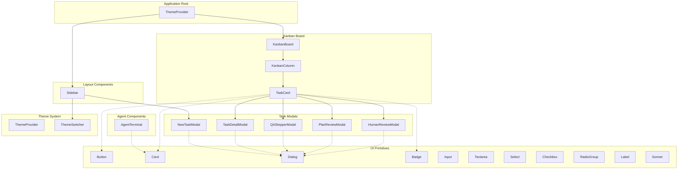
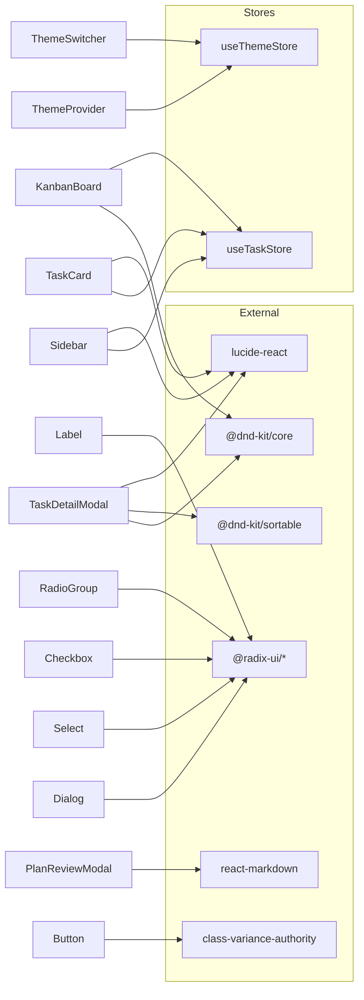

# UI Components

This document describes the UI component hierarchy used in Code-Auto.

## Component Tree



---

## Layout Components

**Directory:** `src/components/layout/`

### Sidebar

**File:** [`sidebar.tsx`](../src/components/layout/sidebar.tsx)

The main navigation sidebar that provides:

- **Project Navigation**: Links to Kanban Board, Agent Terminals, Task List, Settings
- **Tools Section**: Links to GitHub Issues, Git Worktrees, Memory/Context
- **Theme Switcher**: Embedded theme selection dropdown
- **New Task Button**: Opens the NewTaskModal

**Key Features:**
- Uses `usePathname()` for active route highlighting
- Manages `NewTaskModal` open/close state
- Fixed 64-unit width (`w-64`)

**Dependencies:**
- `NewTaskModal` from tasks
- `ThemeSwitcher` from theme
- UI primitives: `Button`

---

## Kanban Board Components

**Directory:** `src/components/kanban/`

### KanbanBoard

**File:** [`board.tsx`](../src/components/kanban/board.tsx)

The main kanban board container with drag-and-drop support.

**Key Features:**
- Uses `@dnd-kit/core` for drag-and-drop
- Renders 5 workflow phase columns: `planning`, `in_progress`, `ai_review`, `human_review`, `done`
- Auto-refreshes tasks every 3 seconds
- Auto-starts agents when tasks are moved to "In Progress"

**Props:** None (uses `useTaskStore` for state)

**Exported Components:**
| Component | Description |
|-----------|-------------|
| `KanbanBoard` | Main board container |

---

### KanbanColumn

**File:** [`column.tsx`](../src/components/kanban/column.tsx)

A single workflow phase column that accepts dropped tasks.

**Props:**
| Prop | Type | Description |
|------|------|-------------|
| `phase` | `WorkflowPhase` | The workflow phase this column represents |
| `tasks` | `Task[]` | Tasks to display in this column |

**Key Features:**
- Uses `useDroppable` from `@dnd-kit/core`
- Phase-specific top border colors
- Shows task count
- Scrollable task list

---

### TaskCard

**File:** [`task-card.tsx`](../src/components/kanban/task-card.tsx)

Draggable task card displayed within columns.

**Props:**
| Prop | Type | Description |
|------|------|-------------|
| `task` | `Task` | The task data to display |

**Key Features:**
- Uses `useDraggable` from `@dnd-kit/core`
- Phase-specific action buttons:
  - **Planning Phase**: Answer Questions, Review Plan, Start Development
  - **In Progress Phase**: Start/Pause Agent
  - **AI Review Phase**: Start/Pause Review
  - **Human Review Phase**: Ready for review indicator
- Opens modals on click: `QAStepperModal`, `PlanReviewModal`, `TaskDetailModal`, `HumanReviewModal`
- Status badge with dynamic colors
- Branch name display with git icon

**Dependencies:**
- UI primitives: `Card`, `Badge`, `Button`
- Task modals: `QAStepperModal`, `PlanReviewModal`, `TaskDetailModal`, `HumanReviewModal`

---

## Task Components

**Directory:** `src/components/tasks/`

### NewTaskModal

**File:** [`new-task-modal.tsx`](../src/components/tasks/new-task-modal.tsx)

Modal for creating new tasks.

**Props:**
| Prop | Type | Description |
|------|------|-------------|
| `open` | `boolean` | Controls modal visibility |
| `onOpenChange` | `(open: boolean) => void` | Callback when visibility changes |

**Key Features:**
- Task title and description inputs
- Dynamic CLI tool selection (fetched from `/api/cli/adapters`)
- Dynamic CLI configuration fields based on selected adapter
- Human review requirement checkbox
- Auto-starts planning after task creation

---

### TaskDetailModal

**File:** [`task-detail-modal.tsx`](../src/components/tasks/task-detail-modal.tsx)

Modal showing task subtasks with drag-and-drop reordering.

**Props:**
| Prop | Type | Description |
|------|------|-------------|
| `open` | `boolean` | Controls modal visibility |
| `onOpenChange` | `(open: boolean) => void` | Callback when visibility changes |
| `task` | `Task` | The task to display details for |

**Key Features:**
- Tabbed interface: Subtasks and Logs
- Sortable subtask list using `@dnd-kit/sortable`
- Skip and delete subtask actions
- Progress indicator
- Phase-aware display (dev subtasks in `in_progress`, QA subtasks in `ai_review`)

---

### QAStepperModal

**File:** [`qa-stepper-modal.tsx`](../src/components/tasks/qa-stepper-modal.tsx)

Multi-step wizard for answering planning questions.

**Props:**
| Prop | Type | Description |
|------|------|-------------|
| `open` | `boolean` | Controls modal visibility |
| `onOpenChange` | `(open: boolean) => void` | Callback when visibility changes |
| `taskId` | `string` | The task ID |
| `questions` | `PlanningQuestion[]` | Questions to answer |

**Key Features:**
- Numbered question navigation with visual progress
- Radio button options for each question
- Optional additional text input
- Skip/unskip functionality
- Submit validation

---

### PlanReviewModal

**File:** [`plan-review-modal.tsx`](../src/components/tasks/plan-review-modal.tsx)

Modal for reviewing AI-generated implementation plans.

**Props:**
| Prop | Type | Description |
|------|------|-------------|
| `open` | `boolean` | Controls modal visibility |
| `onOpenChange` | `(open: boolean) => void` | Callback when visibility changes |
| `taskId` | `string` | The task ID |
| `planContent` | `string` | Markdown plan content |
| `taskTitle` | `string` | Task title for display |

**Key Features:**
- Rendered markdown view with `react-markdown` and `remark-gfm`
- Two modification methods:
  - **Inline Edit**: Direct markdown editing with raw/preview toggle
  - **Feedback**: Natural language feedback for AI regeneration
- Actions: Only Approve, Approve & Start Development

---

### HumanReviewModal

**File:** [`human-review-modal.tsx`](../src/components/tasks/human-review-modal.tsx)

Modal for final human review before merge.

**Props:**
| Prop | Type | Description |
|------|------|-------------|
| `open` | `boolean` | Controls modal visibility |
| `onOpenChange` | `(open: boolean) => void` | Callback when visibility changes |
| `task` | `Task` | The task to review |

**Key Features:**
- Summary of completed dev and QA subtasks
- Git integration status display
- Actions:
  - Create Merge Request
  - Review Changes Locally
  - Open in VS Code
  - Open in File Explorer
- Approve & Merge button

---

## Agent Components

**Directory:** `src/components/agents/`

### AgentTerminal

**File:** [`terminal.tsx`](../src/components/agents/terminal.tsx)

Real-time agent log viewer.

**Props:**
| Prop | Type | Description |
|------|------|-------------|
| `threadId` | `string` | The agent thread ID to stream logs from |

**Key Features:**
- Server-Sent Events (SSE) streaming via `/api/agents/stream`
- Auto-scroll to latest logs
- Status indicator: connecting, running, completed, error, stopped
- Monospace terminal-style display

---

## Theme System

**Directory:** `src/components/theme/`

### ThemeProvider

**File:** [`theme-provider.tsx`](../src/components/theme/theme-provider.tsx)

Context provider that applies theme CSS variables to the document.

**Key Features:**
- Reads theme from `useThemeStore`
- Applies 30+ CSS custom properties to `:root`
- Categories: colors, surfaces, text, status, phases, terminal

**CSS Variables Applied:**
| Category | Variables |
|----------|-----------|
| Base | `--color-background`, `--color-foreground`, `--color-surface`, `--color-surface-hover` |
| Border | `--color-border`, `--color-border-hover` |
| Text | `--color-text-primary`, `--color-text-secondary`, `--color-text-muted` |
| Actions | `--color-primary`, `--color-secondary`, `--color-destructive` (with hover/text variants) |
| Status | `--color-success`, `--color-warning`, `--color-error`, `--color-info` |
| Phases | `--color-phase-discovery`, `--color-phase-requirements`, `--color-phase-context`, `--color-phase-spec`, `--color-phase-planning`, `--color-phase-validate` |
| Workflow | `--color-status-pending`, `--color-status-in-progress`, `--color-status-completed`, `--color-status-blocked` |
| Agent | `--color-agent-active` |
| Terminal | `--color-terminal-background`, `--color-terminal-text` |

---

### ThemeSwitcher

**File:** [`theme-switcher.tsx`](../src/components/theme/theme-switcher.tsx)

Dropdown for selecting themes.

**Key Features:**
- Uses `useThemeStore` for current theme
- Fetches available themes from `getAllThemes()`
- Shows theme display name and description

---

## Shared UI Primitives

**Directory:** `src/components/ui/`

These components are based on [shadcn/ui](https://ui.shadcn.com/) and Radix UI primitives.

| Component | File | Based On | Description |
|-----------|------|----------|-------------|
| **Badge** | [`badge.tsx`](../src/components/ui/badge.tsx) | Custom | Status/label indicators |
| **Button** | [`button.tsx`](../src/components/ui/button.tsx) | Custom | Buttons with variants: default, destructive, outline, secondary, ghost, link |
| **Card** | [`card.tsx`](../src/components/ui/card.tsx) | Custom | Container cards with header, title, description, content, footer |
| **Checkbox** | [`checkbox.tsx`](../src/components/ui/checkbox.tsx) | Radix | Checkboxes |
| **Dialog** | [`dialog.tsx`](../src/components/ui/dialog.tsx) | Radix | Modal dialogs with overlay, header, footer |
| **Input** | [`input.tsx`](../src/components/ui/input.tsx) | Custom | Text input fields |
| **Label** | [`label.tsx`](../src/components/ui/label.tsx) | Radix | Form labels |
| **RadioGroup** | [`radio-group.tsx`](../src/components/ui/radio-group.tsx) | Radix | Radio button groups |
| **Select** | [`select.tsx`](../src/components/ui/select.tsx) | Radix | Dropdown selects |
| **Sonner** | [`sonner.tsx`](../src/components/ui/sonner.tsx) | Sonner | Toast notifications |
| **Textarea** | [`textarea.tsx`](../src/components/ui/textarea.tsx) | Custom | Multi-line text input |

### Button Variants

```tsx
<Button variant="default" />      // Primary action
<Button variant="destructive" />  // Dangerous actions
<Button variant="outline" />      // Secondary with border
<Button variant="secondary" />    // Less prominent
<Button variant="ghost" />        // Minimal styling
<Button variant="link" />         // Text link appearance
```

### Button Sizes

```tsx
<Button size="default" />  // h-10 px-4
<Button size="sm" />       // h-9 px-3
<Button size="lg" />       // h-11 px-8
<Button size="icon" />     // h-10 w-10 (square)
```

---

## Component Dependencies



---

## Usage Examples

### Creating a New Modal

```tsx
import { Dialog, DialogContent, DialogHeader, DialogTitle } from '@/components/ui/dialog';
import { Button } from '@/components/ui/button';

export function MyModal({ open, onOpenChange }) {
  return (
    <Dialog open={open} onOpenChange={onOpenChange}>
      <DialogContent>
        <DialogHeader>
          <DialogTitle>My Modal</DialogTitle>
        </DialogHeader>
        {/* Content */}
        <Button onClick={() => onOpenChange(false)}>Close</Button>
      </DialogContent>
    </Dialog>
  );
}
```

### Using Theme Variables

Components use CSS custom properties for theming:

```tsx
<div
  style={{
    background: 'var(--color-surface)',
    color: 'var(--color-text-primary)',
    borderColor: 'var(--color-border)',
  }}
>
  Content
</div>
```

### Adding a Draggable Item

```tsx
import { useDraggable } from '@dnd-kit/core';

function DraggableItem({ id }) {
  const { attributes, listeners, setNodeRef, isDragging } = useDraggable({ id });
  
  return (
    <div
      ref={setNodeRef}
      {...listeners}
      {...attributes}
      style={{ opacity: isDragging ? 0.5 : 1 }}
    >
      Drag me
    </div>
  );
}
```
