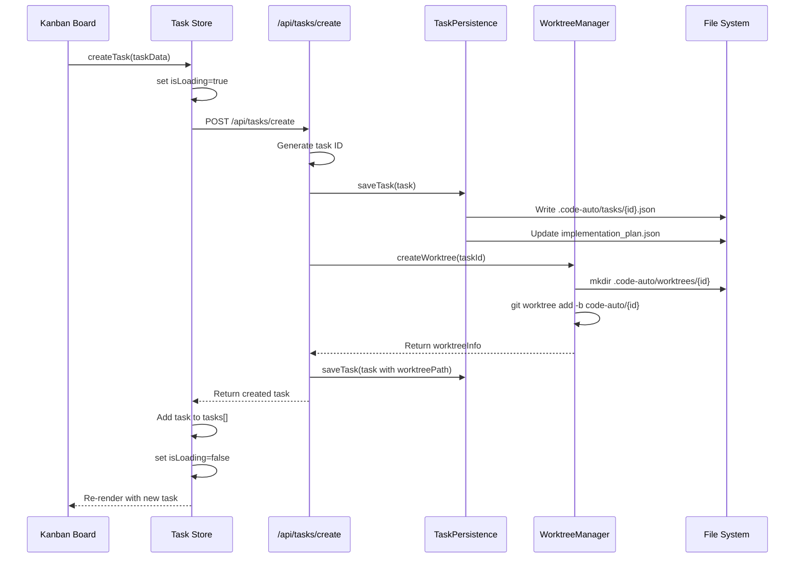
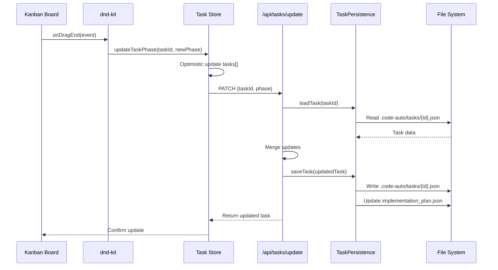
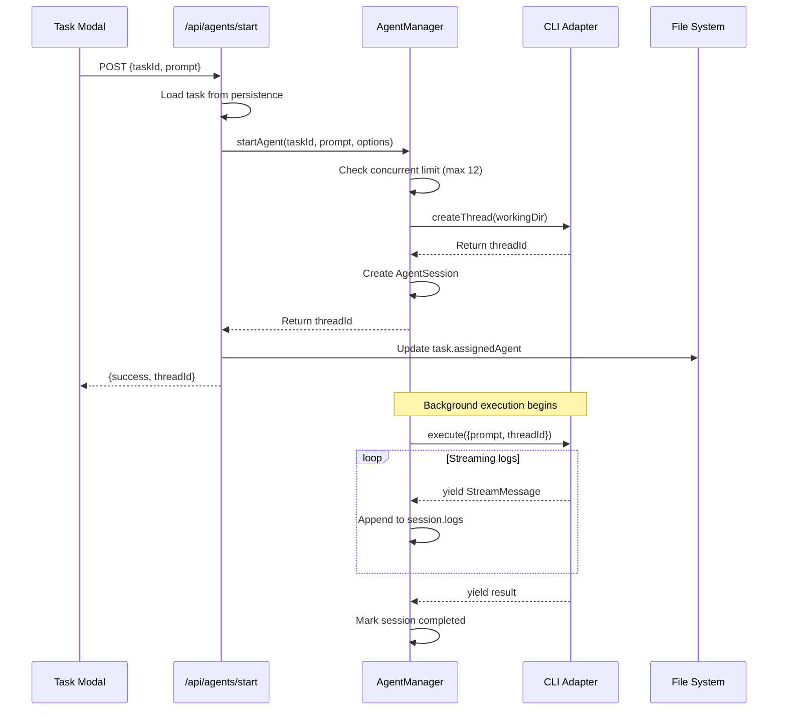
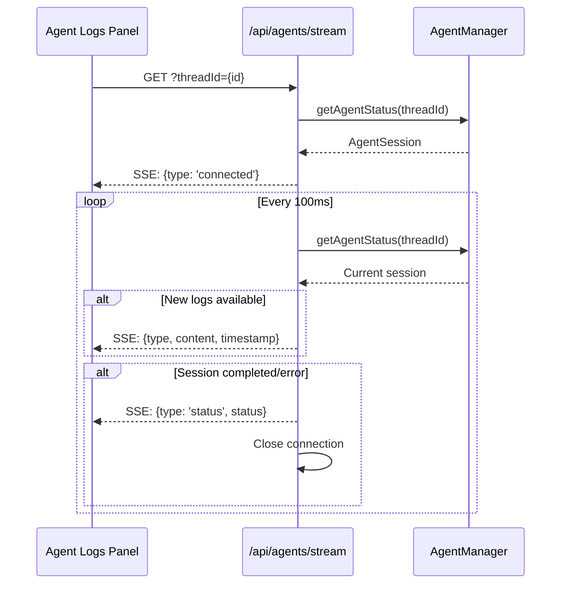
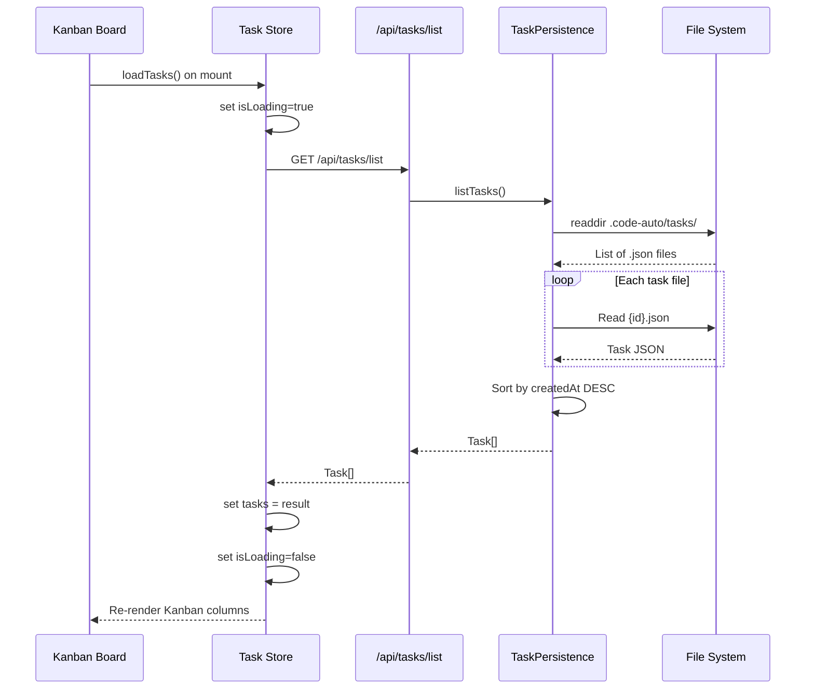

# Data Flow Documentation

This document details how data flows through Code-Auto, from UI actions through API routes to file system operations.

## Overview

Code-Auto uses a unidirectional data flow pattern:

```
UI Components → Zustand Store → API Routes → Core Libraries → File System/Git
```

## Client-Side State Management

### Zustand Stores (`src/store/`)

Two primary stores manage client-side state:

#### Task Store (`task-store.ts`)

Manages all task-related state and provides actions that sync with the server:

| State | Type | Description |
|-------|------|-------------|
| `tasks` | `Task[]` | Array of all tasks |
| `isLoading` | `boolean` | Loading state for async operations |
| `error` | `string \| null` | Error message if operation failed |

**Actions:**

| Action | API Endpoint | Description |
|--------|--------------|-------------|
| `loadTasks()` | `GET /api/tasks/list` | Fetch all tasks from server |
| `createTask()` | `POST /api/tasks/create` | Create new task + worktree |
| `updateTask()` | `PATCH /api/tasks/update` | Update task properties |
| `updateTaskPhase()` | `PATCH /api/tasks/update` | Move task between workflow phases |
| `deleteTask()` | `DELETE /api/tasks/delete` | Remove task and cleanup |

#### Theme Store (`theme-store.ts`)

Persists theme selection to localStorage:

| State | Type | Description |
|-------|------|-------------|
| `currentTheme` | `ThemeName` | Current theme identifier |
| `theme` | `Theme` | Resolved theme configuration |

**Persistence:** Uses `zustand/middleware/persist` with key `code-auto-theme`.

## API Route Handlers

### Task Routes (`/api/tasks/`)

| Endpoint | Method | Handler | Description |
|----------|--------|---------|-------------|
| `/api/tasks/list` | GET | List all tasks | Reads from `.code-auto/tasks/*.json` |
| `/api/tasks/create` | POST | Create task | Creates JSON file + git worktree |
| `/api/tasks/update` | PATCH | Update task | Updates JSON file, handles phase transitions |
| `/api/tasks/delete` | DELETE | Delete task | Removes JSON file |
| `/api/tasks/seed` | POST | Seed test data | Creates sample tasks for development |

### Agent Routes (`/api/agents/`)

| Endpoint | Method | Description |
|----------|--------|-------------|
| `/api/agents/start` | POST | Start AI agent on a task |
| `/api/agents/stop` | POST | Stop running agent |
| `/api/agents/stream` | GET (SSE) | Stream agent logs in real-time |
| `/api/agents/start-planning` | POST | Start planning phase agent |
| `/api/agents/start-development` | POST | Start development phase agent |
| `/api/agents/start-review` | POST | Start review phase agent |
| `/api/agents/approve-plan` | POST | Approve generated plan |
| `/api/agents/submit-answers` | POST | Submit planning Q&A answers |

### Git Routes (`/api/git/`)

| Endpoint | Method | Description |
|----------|--------|-------------|
| `/api/git/status` | GET | Get git status for a worktree |
| `/api/git/worktree` | POST/DELETE | Create or delete worktree |

## Data Persistence Patterns

### File System Structure

```
.code-auto/
├── tasks/                          # Task JSON files
│   ├── task-{id}.json              # Individual task data
│   └── ...
├── worktrees/                      # Git worktrees (one per task)
│   ├── task-{id}/                  # Isolated working directory
│   └── ...
└── implementation_plan.json        # Code-Auto compatibility summary
```

### Task Persistence ([src/lib/tasks/persistence.ts](../src/lib/tasks/persistence.ts))

> Key types: [`Task`](../src/lib/tasks/schema.ts#L46-L82), [`Subtask`](../src/lib/tasks/schema.ts#L84-L92), [`TaskStatus`](../src/lib/tasks/schema.ts#L17), [`WorkflowPhase`](../src/lib/tasks/schema.ts#L15)

The `TaskPersistence` class provides CRUD operations:

```typescript
class TaskPersistence {
  saveTask(task: Task): Promise<void>     // Write to .code-auto/tasks/{id}.json
  loadTask(taskId: string): Promise<Task> // Read from .code-auto/tasks/{id}.json
  listTasks(): Promise<Task[]>            // List all .json files in tasks dir
  deleteTask(taskId: string): Promise<void>
  updateTaskStatus(taskId: string, status: TaskStatus): Promise<void>
  updateTaskPhase(taskId: string, phase: WorkflowPhase): Promise<void>
}
```

See [TYPE_REFERENCE.md](./TYPE_REFERENCE.md#task-types) for complete type definitions.

**Code-Auto Compatibility:** After each save/delete, `updateImplementationPlan()` regenerates `implementation_plan.json` with a summary of all tasks grouped by phase.

## Request Flow Diagrams

### Task Creation Flow



### Task Phase Update Flow (Drag & Drop)



### Agent Execution Flow



### Real-Time Log Streaming Flow



### Task List Loading Flow



## State Synchronization

### Optimistic Updates

The Task Store uses optimistic updates for responsive UI:

1. **UI triggers action** → Store updates local state immediately
2. **API call fires** → Runs in background
3. **On success** → No change needed (state already correct)
4. **On error** → Revert local state, set error message

### Error Handling

All store actions follow this pattern:

```typescript
try {
  set({ isLoading: true, error: null });
  // ... API call
  set({ tasks: updatedTasks, isLoading: false });
} catch (error) {
  set({
    error: error instanceof Error ? error.message : 'Unknown error',
    isLoading: false,
  });
}
```

## Data Flow Summary

| Layer | Responsibility | Key Files |
|-------|----------------|-----------|
| **UI Components** | Render state, trigger actions | `src/components/tasks/` |
| **Zustand Stores** | Client state, API calls | `src/store/*.ts` |
| **API Routes** | HTTP handlers, validation | `src/app/api/**/*.ts` |
| **Core Libraries** | Business logic | `src/lib/tasks/`, `src/lib/agents/`, `src/lib/git/` |
| **File System** | Persistent storage | `.code-auto/tasks/*.json` |
| **Git** | Worktree isolation | `.code-auto/worktrees/` |
