# Kanban Workflow Guide

This document walks through the Code-Auto Kanban workflow using screenshots. Tasks progress through five phases: **Planning** → **In Progress** → **AI Review** → **Human Review** → **Done**.

---

## 1. Select Project

On startup, select a project folder to work with. The project must be a git repository within your home directory. Recent projects are listed for quick re-selection.

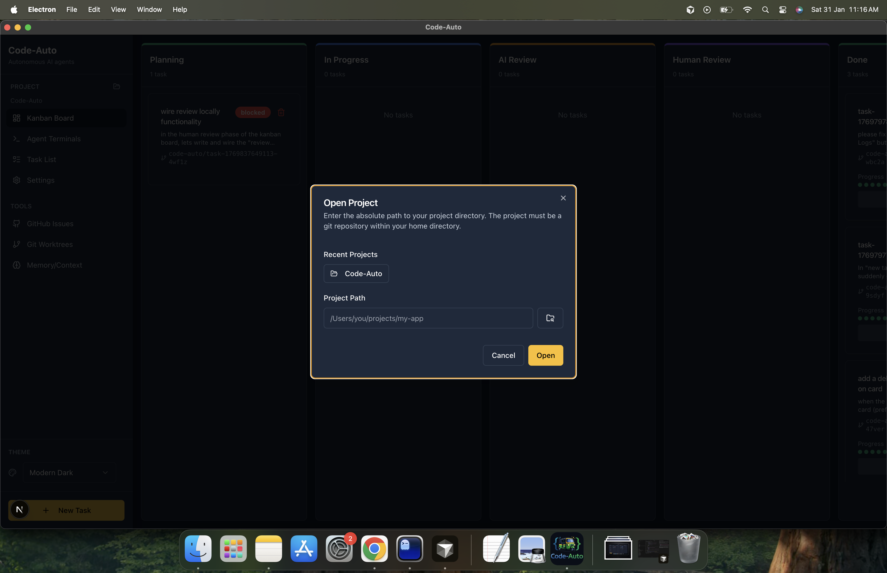

---

## 2. Planning

Create a new task and add it to the Kanban board. The task enters the **Planning** phase, where the AI generates clarifying questions or an implementation plan based on your description.

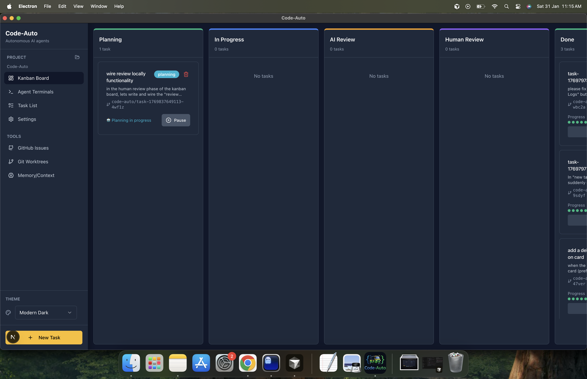

---

## 3. Planning Q&A

If the AI needs clarification, it presents questions. Answer them to help refine the plan. You can select predefined options or provide custom answers. Use **Next** to proceed, **Skip** to bypass, or **Previous** to go back.

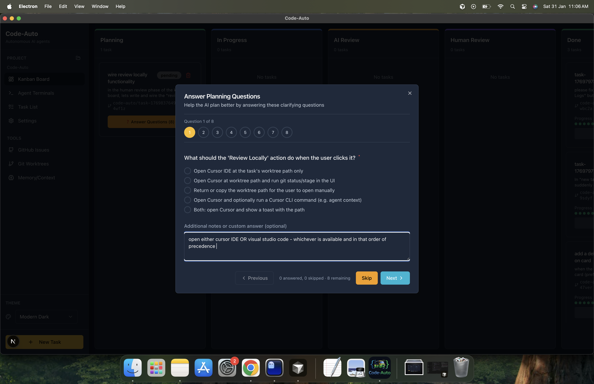

---

## 4. Review Implementation Plan

Once the AI generates a plan, review it before development starts. You can **Modify Plan** to request changes, **Only Approve** to accept as-is, or **Approve & Start** to approve and immediately begin development.

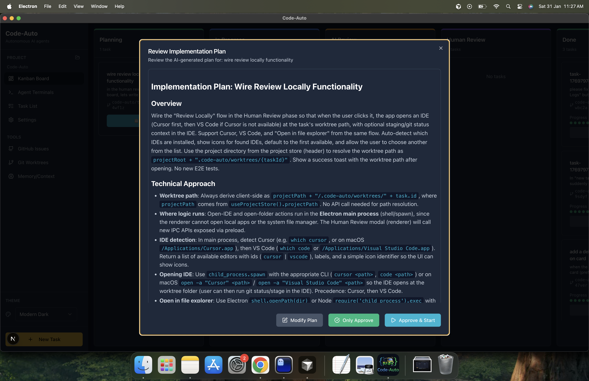

---

## 5. AI Development Start

After approval, the task moves to **In Progress**. The AI agent begins executing development subtasks in an isolated git worktree. Progress is shown on the task card.

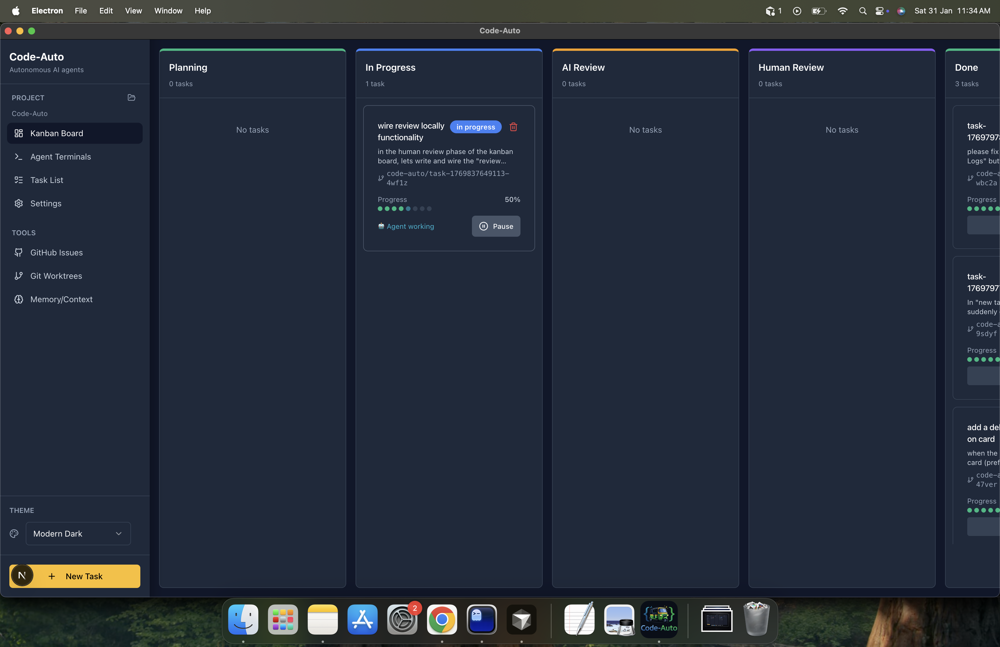

---

## 6. AI Subtask Execution

The task modal shows development subtasks with their status (pending, in progress, completed). You can monitor progress and use **Skip current** if needed. The agent works through each subtask sequentially.

---

## 7. AI Review (QA)

When development subtasks complete, the task moves to **AI Review**. The AI runs QA checks (e.g., build verification, type checking, linting) on the changes.

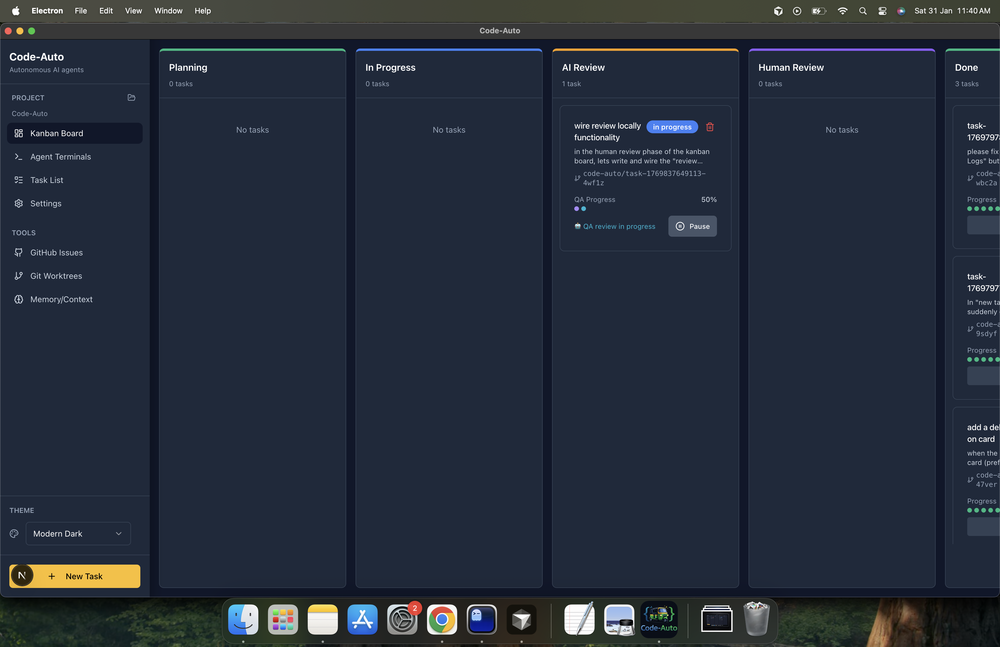

---

## 8. AI QA Subtasks Execution

QA subtasks are executed similarly to development. The modal shows verification steps like "Verify build" and "Verify types and lint" with their completion status.

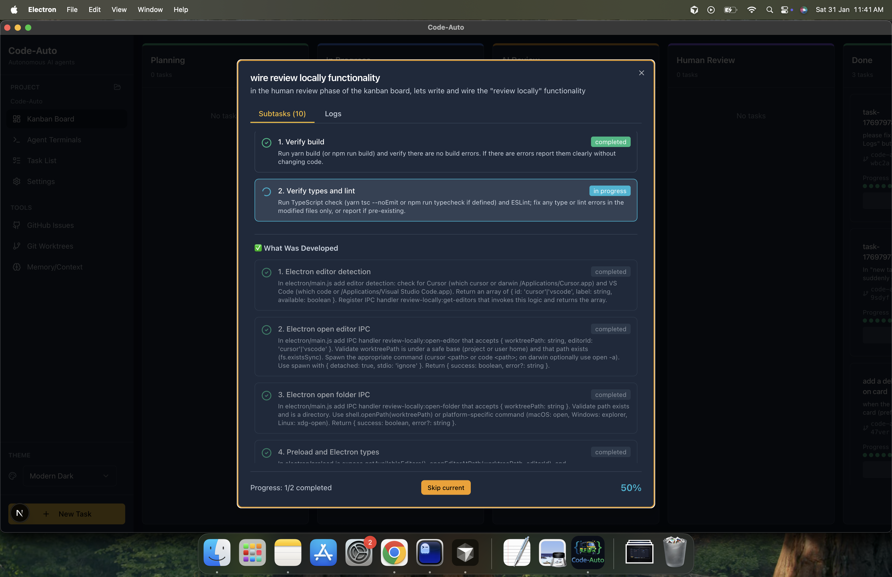

---

## 9. Human Review

Once QA passes, the task moves to **Human Review**. The task card shows **Ready for human review**. Open the task to review changes, run tests locally, or create a merge request.

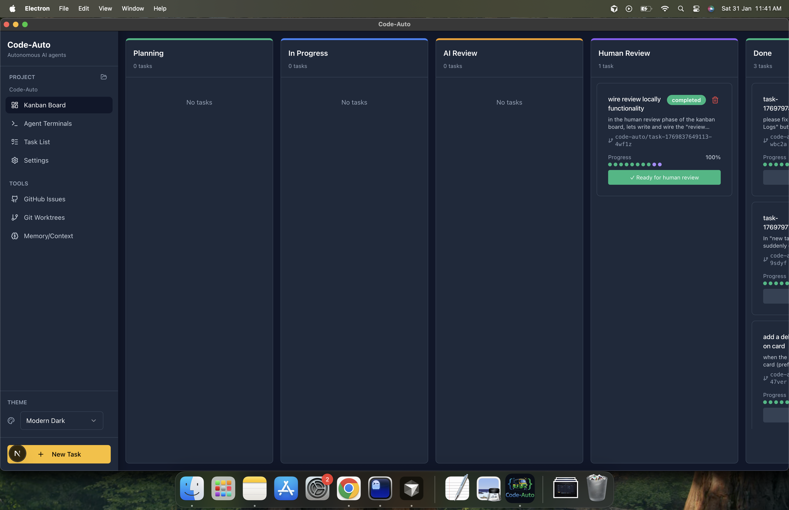

---

## 10. Human Review – Create MR or Review Locally

In the Human Review modal, you can:

- **Create MR** — Push changes and create a merge request for code review
- **Review Locally** — Open Cursor or VS Code at the task worktree, or open the folder in the file manager

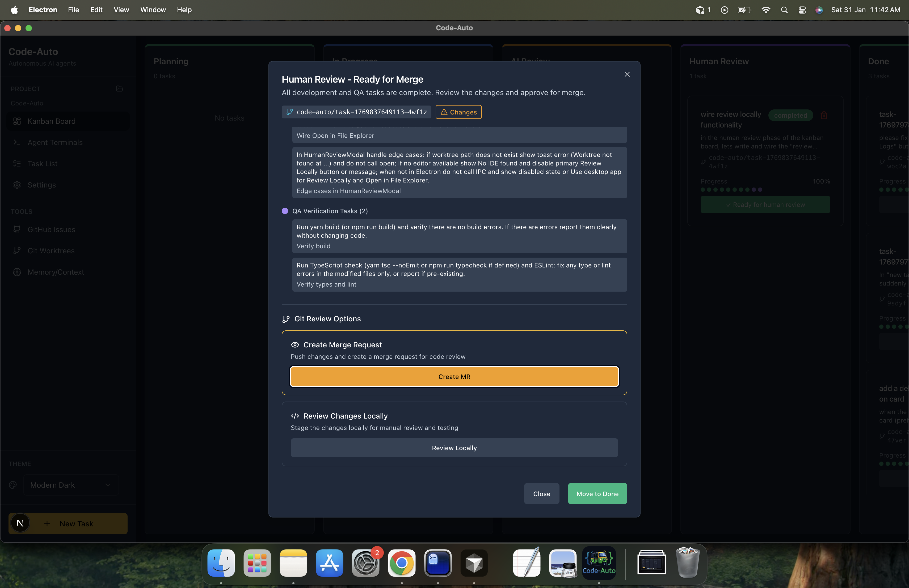

---

## 11. GitHub Merge Request

After creating a merge request, the branch is pushed to GitHub. The PR can be reviewed, discussed, and merged. The branch name follows the pattern `code-auto/task-{id}`.

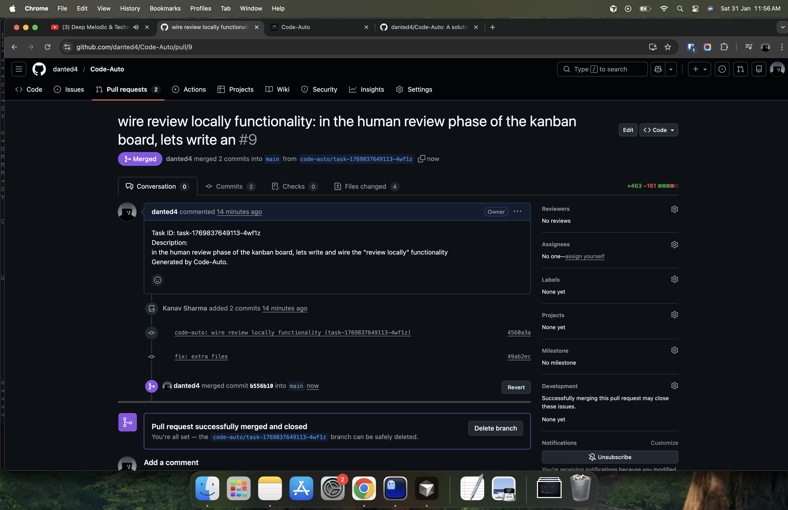

---

## 12. Task Done

When you **Move to Done** (or merge the PR and complete the workflow), the task moves to the **Done** column. It shows a **Completed** badge and full progress.

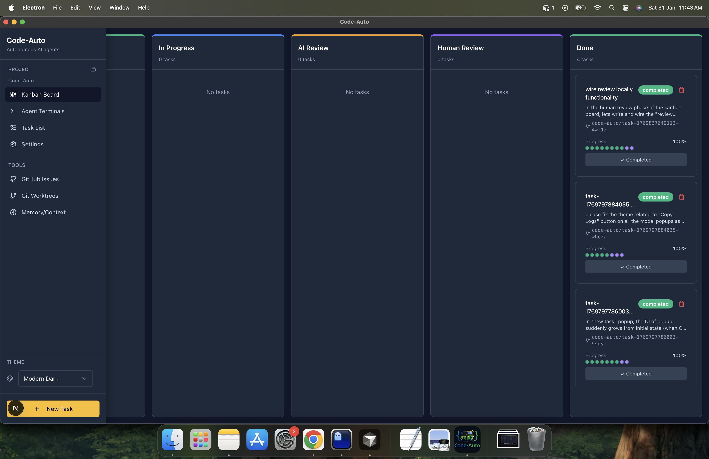

---

## 13. View Subtasks in Done State

Completed tasks remain in the Done column. Open any task to view its completed subtasks, logs, and implementation details.

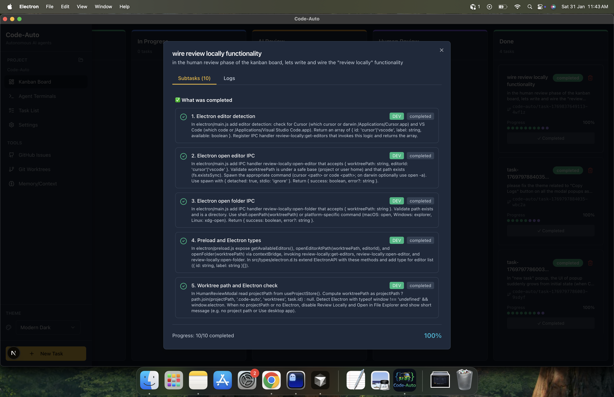

---

## Summary

| Phase            | Description                                            |
| ---------------- | ------------------------------------------------------ |
| **Planning**     | Create task, answer questions, review and approve plan |
| **In Progress**  | AI executes development subtasks in isolated worktree  |
| **AI Review**    | AI runs QA checks (build, types, lint)                 |
| **Human Review** | Review changes, create MR, or test locally             |
| **Done**         | Task completed, ready for merge or archival            |
