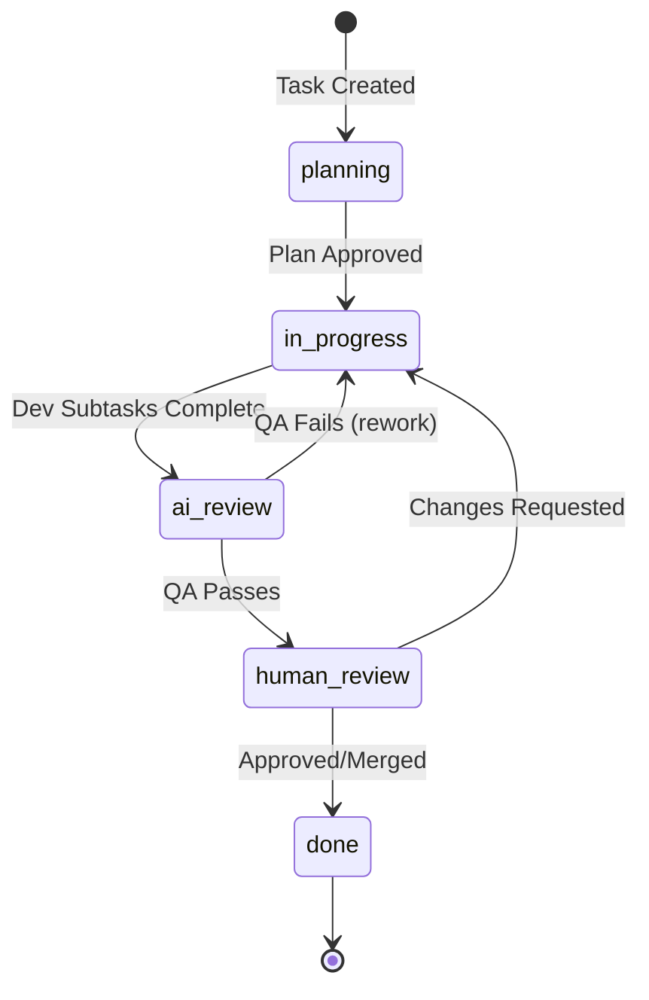

# Code-Auto Overview

## Overview

Code-Auto is a Next.js application that orchestrates AI coding tasks through a structured 5-phase Kanban workflow. It automates AI-driven development by managing tasks through planning, implementation, review, and completion phases—each running in an isolated git worktree with its own branch.

The system acts as a bridge between developers and AI coding agents (like Amp), providing:

- **Visual task management** via a Kanban board interface
- **Process automation** through a defined workflow from planning to completion
- **Parallel execution** with up to 12 concurrent AI agents
- **Git isolation** ensuring each task's changes remain separate until ready for merge

### How It Works

1. **Create a task** with a description of what you want to accomplish
2. **Planning phase** generates clarifying questions and an implementation plan
3. **Development phase** breaks the plan into subtasks and executes them via AI agents
4. **AI Review phase** runs QA verification on the changes
5. **Human Review phase** allows you to inspect, approve, and merge the work

All file changes happen inside the task's dedicated worktree (`.code-auto/worktrees/{taskId}/`), keeping your main branch clean until you're ready to integrate.

## Features

### 5-Phase Kanban Workflow

Tasks progress through a structured pipeline:

| Phase | Description |
|-------|-------------|
| **Planning** | AI generates questions, user provides answers, AI creates implementation plan |
| **In Progress** | AI agents execute development subtasks in isolated worktree |
| **AI Review** | Automated QA verification of implementation |
| **Human Review** | Developer reviews and approves changes |
| **Done** | Task complete, changes ready for merge |

### Git Worktree Isolation

Each task operates in complete isolation:

- **Dedicated worktree**: `.code-auto/worktrees/{taskId}/`
- **Dedicated branch**: `code-auto/{taskId}`
- **No cross-contamination**: Parallel tasks never interfere with each other
- **Clean main branch**: Changes only merge when explicitly approved

### CLI Adapters

Code-Auto uses a **pluggable adapter pattern** to abstract CLI tool interactions, enabling support for multiple AI coding assistants without modifying core orchestration logic.

| Adapter | Provider | Description | Use Case |
|---------|----------|-------------|----------|
| **MockCLIAdapter** | `mock` | Simulated responses with configurable delays | Testing, UI development, E2E tests |
| **AmpAdapter** | `amp` | Sourcegraph Amp SDK integration | Production AI execution |

**Key Capabilities:**
- **Dynamic provider selection** — Each task can specify its own CLI provider via `task.cliTool`
- **Thread management** — Create, resume, and stop isolated execution threads
- **Context injection** — Memory patterns and project-specific knowledge injected into prompts
- **Streaming output** — Real-time message streaming via `AsyncIterable<StreamMessage>`

**Adding new providers:** Implement the [`CLIAdapter`](../src/lib/cli/base.ts) interface and register in [`CLIFactory`](../src/lib/cli/factory.ts).

For the full adapter architecture, types, and implementation guide, see [CLI Adapters](./CLI_ADAPTERS.md).

### Real-Time Streaming

Agent output streams to the UI via Server-Sent Events (SSE):

- Live terminal view of agent execution
- Per-task log history
- Concurrent streaming for multiple agents

### File-Based Persistence

Simple, transparent storage model:

- **Tasks**: `.code-auto/tasks/{taskId}.json`
- **Logs**: `.code-auto/tasks/{taskId}/*-logs.txt`
- No database required—everything is version-controllable

### Automatic Subtask Generation

When a plan is approved:

1. AI breaks the plan into discrete subtasks
2. Development subtasks (`type: dev`) execute sequentially
3. QA subtasks (`type: qa`) run automatically after development completes
4. Each subtask tracks its own status and logs

### Planning Intelligence

Two planning modes available:

| Mode | Description |
|------|-------------|
| **With Human Review** | AI asks clarifying questions → User answers → AI generates plan → User approves |
| **Auto-Plan** | AI generates plan and subtasks directly without user intervention |

### Concurrent Agent Management

The AgentManager supports:

- Up to **12 concurrent agents**
- Per-task agent assignment
- Centralized session tracking via registry
- Graceful stop/restart capabilities

## Workflow

Code-Auto implements a structured 5-phase workflow that guides tasks from initial planning through completion. Each phase has specific entry/exit conditions and automation triggers.

### Workflow State Diagram



### Phase Summary

| Phase | Purpose | Entry Trigger | Exit Trigger | Automation |
|-------|---------|---------------|--------------|------------|
| **Planning** | Generate implementation plan via AI-assisted Q&A | Task created | User approves plan | AI generates questions → user answers → AI creates plan |
| **In Progress** | Execute development subtasks in isolated worktree | Plan approved | All `dev` subtasks completed | Dev agent spawned; worktree created |
| **AI Review** | Automated QA verification of implementation | Dev complete | All `qa` subtasks pass | QA agent auto-spawned |
| **Human Review** | Developer inspects changes and approves/rejects | QA passes | User approves or merges PR | Notification sent |
| **Done** | Task complete, branch ready for merge | Human approval | N/A (terminal) | Optional branch cleanup |

### Planning Phase Sub-States

The planning phase has internal states tracked by `planningStatus`:

| Status | Description |
|--------|-------------|
| `not_started` | Task created, planning not initiated |
| `generating_questions` | AI analyzing requirements, generating clarifying questions |
| `waiting_for_answers` | Questions displayed, awaiting user input |
| `generating_plan` | AI generating implementation plan from answers |
| `plan_ready` | Plan generated, awaiting user approval |
| `plan_approved` | User approved plan, ready to transition to `in_progress` |

### Backward Transitions (Rework)

Tasks can move backward in the workflow when issues are found:

- **AI Review → In Progress**: QA subtask fails or reports issues → dev agent re-spawned for fixes
- **Human Review → In Progress**: User requests changes → dev agent re-spawned

### Subtask Completion Rules

| Parent Phase | Subtask Type | Completion Rule |
|--------------|--------------|-----------------|
| `in_progress` | `dev` | Task advances when ALL `dev` subtasks have `status: completed` |
| `ai_review` | `qa` | Task advances when ALL `qa` subtasks have `status: completed` |

For complete workflow state machine details, see [Architecture: Task Lifecycle](./ARCHITECTURE.md#5-phase-task-workflow).

## Quick Reference

### Project Structure

```
src/
├── app/                 # Next.js App Router
│   └── api/             # API routes
│       ├── tasks/       # Task CRUD
│       ├── agents/      # Agent execution
│       └── git/         # Worktree operations
├── components/          # React components
│   └── tasks/           # Task-related UI
├── lib/                 # Core business logic
│   ├── cli/             # CLI adapters
│   ├── git/             # WorktreeManager
│   ├── agents/          # Agent orchestration
│   └── tasks/           # Task schema/storage
└── store/               # Zustand stores
```

### Key Directories

| Path | Purpose |
|------|---------|
| `src/app/` | Next.js App Router pages and API routes |
| `src/app/api/` | REST API endpoints for tasks, agents, and git operations |
| `src/components/` | React UI components (Kanban board, task cards, modals) |
| `src/lib/cli/` | CLI adapter implementations (Mock, Amp) |
| `src/lib/agents/` | Agent orchestration and session management |
| `src/lib/git/` | WorktreeManager for git worktree operations |
| `src/lib/tasks/` | Task schema, validation, and persistence |
| `src/store/` | Zustand state stores for client-side state |
| `.code-auto/tasks/` | Task JSON files (file-based persistence) |
| `.code-auto/worktrees/` | Per-task git worktrees for isolation |

### API Overview

The application exposes a REST API for programmatic control. Key endpoint groups:

| API Group | Key Endpoints | Description |
|-----------|---------------|-------------|
| **Agents** | `POST /api/agents/start-planning`<br>`POST /api/agents/start-development`<br>`POST /api/agents/start-review`<br>`POST /api/agents/stop` | Manage AI agent lifecycle—start planning, development, or review phases; stop running agents |
| **Tasks** | `POST /api/tasks/create`<br>`GET /api/tasks/list`<br>`POST /api/tasks/update`<br>`DELETE /api/tasks/delete` | CRUD operations for tasks; move, archive, and manage task state |
| **Subtasks** | `POST /api/tasks/add-subtask`<br>`POST /api/tasks/reorder-subtasks`<br>`POST /api/tasks/skip-subtask` | Add, reorder, skip, or delete subtasks within a task |
| **Git** | `GET /api/git/changes`<br>`POST /api/git/commit` | View uncommitted changes and commit from the worktree |
| **Streaming** | `GET /api/agents/stream` | Server-Sent Events for real-time agent log streaming |
| **CLI** | `GET /api/amp/preflight` | Check Amp SDK availability and configuration |

All endpoints return JSON and follow consistent error handling with appropriate HTTP status codes (400, 404, 409, 500).

For the complete API reference including request/response schemas, see [API Routes](./API_ROUTES.md).

### Technology Stack

- **Framework**: Next.js 15 (App Router)
- **Language**: TypeScript
- **Styling**: Tailwind CSS + shadcn/ui
- **State**: Zustand
- **Drag & Drop**: dnd-kit
- **AI Integration**: @sourcegraph/amp-sdk

## Related Documentation

- [Architecture](./ARCHITECTURE.md) — System design and component details
- [API Routes](./API_ROUTES.md) — Complete API reference
- [CLI Adapters](./CLI_ADAPTERS.md) — Adapter implementation guide
- [Worktree Management](./WORKTREE.md) — Git worktree operations
- [Components](./COMPONENTS.md) — UI component reference
- [Data Flow](./DATA_FLOW.md) — Request/response flows
- [Type Reference](./TYPE_REFERENCE.md) — TypeScript type definitions
