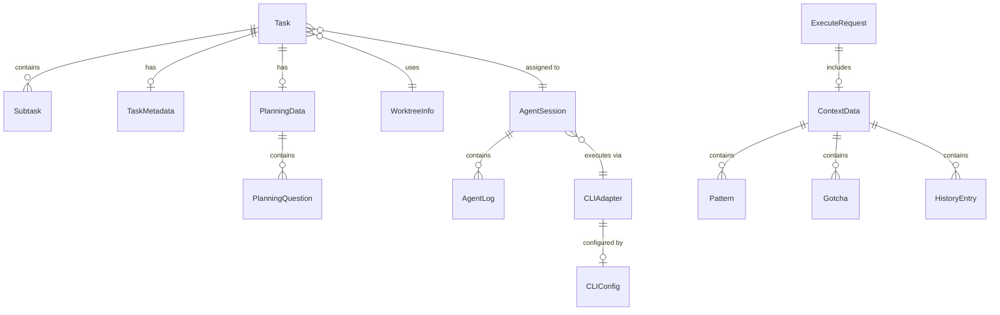

# Type Reference

This document provides a comprehensive reference for the key TypeScript interfaces and types used throughout Code-Auto.

## Task Types

> Source: [src/lib/tasks/schema.ts](../src/lib/tasks/schema.ts)

### Task

The primary task entity representing a unit of work in the Kanban workflow.

```typescript
interface Task {
  id: string;                          // Unique task identifier
  title: string;                       // Display title
  description: string;                 // Full task description
  phase: WorkflowPhase;                // Current workflow phase
  status: TaskStatus;                  // Execution status
  subtasks: Subtask[];                 // Child subtasks

  // CLI Configuration
  cliTool?: string;                    // 'amp', 'aider', 'cursor', etc.
  cliConfig?: Record<string, any>;     // Dynamic CLI-specific config

  // Workflow Control
  requiresHumanReview?: boolean;       // If true, task locked until plan approved
  planApproved?: boolean;              // Plan approval status
  locked?: boolean;                    // Locked tasks can't be dragged

  // Planning Phase
  planningStatus?: PlanningStatus;     // Current planning stage
  planningData?: PlanningData;         // Q&A data
  planContent?: string;                // Generated plan.md content
  planningLogsPath?: string;           // Path to planning-logs.txt

  // Execution
  assignedAgent?: string;              // Thread ID if agent is working on this
  worktreePath?: string;               // Path to isolated worktree
  branchName?: string;                 // code-auto/{task-id}

  // Integrations
  githubIssue?: number;
  gitlabIssue?: number;

  // Timestamps
  createdAt: number;
  updatedAt: number;
  metadata: TaskMetadata;
}
```

### Subtask

Represents a child task within a parent task.

```typescript
interface Subtask {
  id: string;                          // Unique subtask identifier
  content: string;                     // Detailed subtask description
  label: string;                       // Short label for UI display
  status: TaskStatus;                  // Current status
  type: 'dev' | 'qa';                  // Development or QA verification subtask
  activeForm?: string;                 // e.g., "Running tests" when in_progress
  completedAt?: number;                // Completion timestamp
}
```

### WorkflowPhase

The 5-phase task workflow.

```typescript
type WorkflowPhase = 'planning' | 'in_progress' | 'ai_review' | 'human_review' | 'done';
```

| Phase | Description |
|-------|-------------|
| `planning` | Plan and specification review |
| `in_progress` | Active development (WIP) |
| `ai_review` | Automated QA and validation |
| `human_review` | Manual review and approval |
| `done` | Completed tasks |

### TaskStatus

```typescript
type TaskStatus = 'pending' | 'in_progress' | 'completed' | 'blocked' | 'planning';
```

### PlanningStatus

```typescript
type PlanningStatus =
  | 'not_started'
  | 'generating_questions'
  | 'waiting_for_answers'
  | 'generating_plan'
  | 'plan_ready'
  | 'plan_approved';
```

### PlanningQuestion

```typescript
interface PlanningQuestion {
  id: string;
  question: string;
  options: string[];
  answer: {
    selectedOption: string;
    additionalText: string;
  };
  required: boolean;
  order: number;
}
```

### PlanningData

```typescript
interface PlanningData {
  questions: PlanningQuestion[];
  generatedAt?: number;
  answeredAt?: number;
  status: 'pending' | 'in_progress' | 'completed';
}
```

### TaskMetadata

```typescript
interface TaskMetadata {
  estimatedComplexity?: 'low' | 'medium' | 'high';
  dependencies?: string[];             // Other task IDs
  tags?: string[];
  isTestData?: boolean;                // Flag for e2e cleanup
}
```

---

## Agent Types

> Source: [src/lib/agents/manager.ts](../src/lib/agents/manager.ts)

### AgentSession

Represents an active AI agent working on a task.

```typescript
interface AgentSession {
  taskId: string;                      // Task being worked on
  threadId: string;                    // CLI thread identifier
  status: 'running' | 'completed' | 'error' | 'stopped';
  startedAt: number;                   // Start timestamp
  completedAt?: number;                // End timestamp
  logs: AgentLog[];                    // Execution logs
  error?: string;                      // Error message if failed
}
```

### AgentLog

```typescript
interface AgentLog {
  timestamp: number;
  type: string;                        // Message type from CLI
  content: unknown;                    // Message payload
}
```

### AgentOptions

```typescript
interface AgentOptions {
  workingDir: string;                  // Working directory (worktree path)
  context?: ContextData;               // Injected memory context
  onComplete?: (result: AgentResult) => void | Promise<void>;
}
```

### AgentResult

```typescript
interface AgentResult {
  success: boolean;
  output: string;                      // Collected output from agent
  error?: string;                      // Error message if failed
}
```

---

## CLI Adapter Types

> Source: [src/lib/cli/base.ts](../src/lib/cli/base.ts)

### CLIAdapter

The core interface that all CLI adapters must implement.

```typescript
interface CLIAdapter {
  name: string;                        // Internal identifier
  displayName: string;                 // Human-readable name

  getConfigSchema(): CLIConfigSchema;
  initialize(config: CLIConfig): Promise<void>;
  execute(request: ExecuteRequest): AsyncIterable<StreamMessage>;
  createThread(workingDir: string): Promise<string>;
  resumeThread(threadId: string): Promise<void>;
  stopThread(threadId: string): Promise<void>;
  getCapabilities(): CLICapabilities;
}
```

### CLIConfig

```typescript
interface CLIConfig {
  apiKey: string;                      // API authentication key
  cwd: string;                         // Working directory
  mode?: 'smart' | 'rush';             // smart = Opus 4.5, rush = Haiku 4.5
  logLevel?: 'debug' | 'info' | 'error';
  permissions?: PermissionRule[];
  maxConcurrentAgents?: number;
}
```

### ExecuteRequest

```typescript
interface ExecuteRequest {
  prompt: string;                      // Task prompt
  threadId?: string;                   // Optional: resume existing thread
  context?: ContextData;               // Optional: injected memory context
  permissions?: PermissionRule[];
}
```

### StreamMessage

```typescript
interface StreamMessage {
  type: 'system' | 'assistant' | 'tool' | 'result' | 'error';
  timestamp: number;
  data: unknown;                       // Type-specific payload
  threadId: string;
}
```

### CLICapabilities

```typescript
interface CLICapabilities {
  supportsThreads: boolean;
  supportsModes: string[];             // Available modes (e.g., ['smart', 'rush'])
  maxConcurrentAgents: number;
  supportsPermissions: boolean;
}
```

### PermissionRule

```typescript
interface PermissionRule {
  action: string;                      // Action identifier
  allowed: boolean;                    // Whether action is permitted
}
```

### ContextData

Memory context injected into agent prompts.

```typescript
interface ContextData {
  patterns?: Pattern[];                // Code patterns discovered
  gotchas?: Gotcha[];                  // Known issues and solutions
  history?: HistoryEntry[];            // Task execution history
}
```

### Pattern

```typescript
interface Pattern {
  category: string;
  description: string;
  example?: string;
  addedAt: number;
}
```

### Gotcha

```typescript
interface Gotcha {
  issue: string;
  solution: string;
  context?: string;
  addedAt: number;
}
```

### HistoryEntry

```typescript
interface HistoryEntry {
  taskId: string;
  phase: string;
  success: boolean;
  duration: number;
  timestamp: number;
}
```

### CLIConfigSchema

Defines UI configuration fields for dynamic form generation.

```typescript
interface CLIConfigSchema {
  fields: ConfigField[];
}

interface ConfigField {
  name: string;
  label: string;
  type: 'select' | 'number' | 'boolean' | 'text';
  options?: { value: string; label: string }[];
  default?: any;
  description?: string;
}
```

---

## Git Worktree Types

> Source: [src/lib/git/worktree.ts](../src/lib/git/worktree.ts)

### WorktreeInfo

Information about a created worktree.

```typescript
interface WorktreeInfo {
  path: string;                        // Full path to worktree directory
  branchName: string;                  // Git branch name (code-auto/{task-id})
  taskId: string;                      // Unique task identifier
  mainRepo: string;                    // Path to main repository
  mainBranch: string;                  // Main branch name (main/master)
}
```

### WorktreeStatus

Status of a worktree.

```typescript
interface WorktreeStatus {
  exists: boolean;                     // Whether worktree exists
  path?: string;                       // Full path if exists
  branchName?: string;                 // Current branch if exists
  hasChanges?: boolean;                // Has any changes (staged or unstaged)
  isDirty?: boolean;                   // Has uncommitted changes
  error?: string;                      // Error message if check failed
}
```

---

## Type Relationships



## Import Examples

```typescript
// Task types
import { Task, Subtask, WorkflowPhase, TaskStatus } from '@/lib/tasks/schema';

// Agent types
import { AgentSession, AgentOptions, AgentResult } from '@/lib/agents/manager';

// CLI types
import {
  CLIAdapter,
  CLIConfig,
  ExecuteRequest,
  StreamMessage,
  ContextData,
} from '@/lib/cli/base';

// Git types
import { WorktreeInfo, WorktreeStatus } from '@/lib/git/worktree';
```
